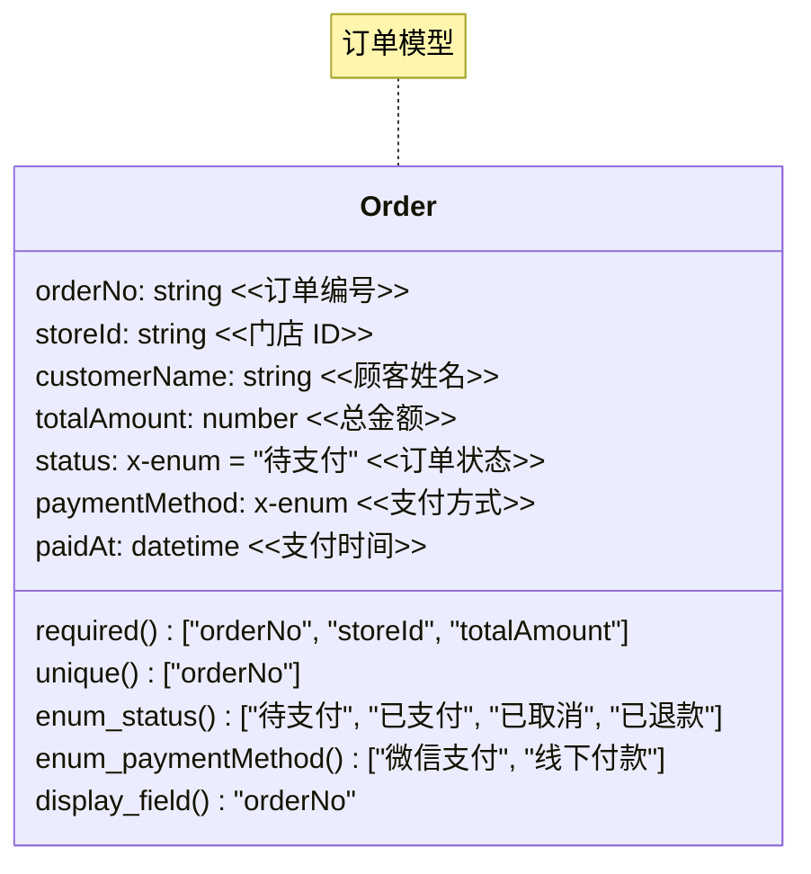

> 设计前请先了解 `.42cog/real.md`（业务约束）和 `.42cog/cog.md`（认知模型）。

## 何时使用此技能

在进行 **微信小程序数据库设计** 时使用，包括：

- 选择 NoSQL 还是 MySQL 数据库
- 设计集合/表结构与数据建模
- 配置数据库安全规则
- 编写数据库查询操作
- 地理位置查询、聚合分析、分页

**不适用于：**
- 前端页面开发（请使用 `wx-ui-design` / `wx-coding`）
- 云函数开发（请使用 `wx-coding`）
- Web 端数据库操作（请使用 CloudBase Web SDK 相关文档）

---

# 数据库选型决策框架

## NoSQL vs MySQL 对比

| 维度 | CloudBase NoSQL（文档数据库） | CloudBase MySQL（关系型数据库） |
|------|------|------|
| **数据结构** | 灵活 schema，嵌套文档 | 严格 schema，关系表 |
| **实时推送** | 支持 `.watch()` 实时监听 | 不支持 |
| **事务** | 支持（`db.runTransaction`） | 原生 ACID 事务 |
| **安全规则** | READONLY/PRIVATE/ADMINWRITE/CUSTOM | 同上 |
| **小程序端直调** | `wx.cloud.database()` 直接操作 | 需通过数据模型 SDK |
| **复杂查询** | 聚合管道，地理位置查询 | 标准 SQL，JOIN |
| **适用场景** | 实时数据、灵活结构、watch 推送 | 复杂关联、严格事务、报表统计 |

## 选型建议

- **需要实时推送（如订单状态变更）** → NoSQL（支持 watch）
- **需要复杂 JOIN 和事务一致性** → MySQL
- **双库混用**：实时数据存 NoSQL，主数据源存 MySQL/外部 SQL Server，创建订单先写 NoSQL 触发 watch 再同步 MySQL

---

# Mermaid 数据建模

当需要为复杂业务创建可视化数据模型文档时使用。

## classDiagram 语法规则

### 类型映射

| 业务字段 | Mermaid 类型 |
|---|---|
| 文本 | string |
| 数字 | number |
| 布尔值 | boolean |
| 枚举 | x-enum |
| 邮箱 | email |
| 手机号 | phone |
| URL | url |
| 文件 | x-file |
| 图片 | x-image |
| 富文本 | x-rtf |
| 地区 | x-area-code |
| 时间 | time |
| 日期 | date |
| 日期时间 | datetime |
| 对象 | object |
| 数组 | string[] |
| 位置 | x-location |

### 命名规范

- 类名：PascalCase（中文转英文）
- 字段名：camelCase
- 枚举值：保留中文原文

### 标准示例



### 关系标注

- `A "n" --> "1" B : fieldName` — A 多对一 B，数据在 A 的 fieldName 字段
- `A "1" --> "1" B : fieldName` — 一对一关系
- `A "n" --> "m" B : fieldName` — 多对多关系

### Mermaid 类型 → MySQL 类型映射

当 Mermaid 模型需要落地为 MySQL 表时，使用以下映射：

| Mermaid 类型 | MySQL 类型 | 备注 |
|---|---|---|
| `string` | `VARCHAR(255)` / `TEXT` | 短文本用 VARCHAR，长文本用 TEXT |
| `number` | `INT` / `DECIMAL(10,2)` | 整数用 INT，金额用 DECIMAL |
| `boolean` | `TINYINT(1)` | 0/1 |
| `x-enum` | `ENUM('值1','值2')` | 枚举值原样匹配 |
| `date` / `datetime` / `time` | `DATE` / `DATETIME` / `TIME` | 对应映射 |
| `email` / `phone` / `url` | `VARCHAR(255)` | 加业务校验 |
| `x-file` / `x-image` | `VARCHAR(500)` | 存文件路径/URL |
| `x-rtf` | `LONGTEXT` | 富文本 |
| `x-area-code` | `VARCHAR(20)` | 地区编码 |
| `x-location` | `POINT` / `VARCHAR(50)` | 地理坐标 |
| `string[]` | `JSON` / 中间表 | 简单数组用 JSON，多对多用中间表 |

---

# NoSQL 文档数据库设计

## 集合命名规范

- 使用 **camelCase**（如 `orders`、`serviceRecords`、`bindingApplies`）
- 同一项目内所有集合名称保持风格一致
- **建议**为同一项目中的所有集合添加统一前缀（如 `fy_orders`、`fy_customers`），避免与其他项目冲突

## 类型定义规范

**强烈建议**为每个集合创建 TypeScript 类型定义，作为数据库 schema 的唯一可信来源：

```typescript
// models/order.ts
interface IOrder {
  _id: string
  _openid: string
  orderNo: string        // FY-XSD{YYMMDD}{序号}
  storeId: string
  customerId: string
  customerName: string   // 冗余常读字段
  items: IOrderItem[]
  totalAmount: number
  status: '待支付' | '已支付' | '已取消' | '已退款'
  paymentMethod: '微信支付' | '线下付款'
  paidAt?: Date
  createdAt: Date
  updatedAt: Date
}
```

## 初始化与引用

```javascript
// 小程序端 — 默认环境
const db = wx.cloud.database()
const _ = db.command  // 查询操作符

// 小程序端 — 指定环境（多环境测试时使用）
const testDb = wx.cloud.database({ env: 'test-env-id' })

// 云函数端
const cloud = require('wx-server-sdk')
cloud.init({ env: cloud.DYNAMIC_CURRENT_ENV })
const db = cloud.database()
const _ = db.command
```

## 索引策略

- 为频繁 `where` 查询的字段创建索引
- 为 `orderBy` 排序字段创建索引
- 地理位置字段必须创建 `2dsphere` 索引
- 复合索引应匹配最常用的查询模式

## 安全规则

在编写代码前**必须先配置安全规则**。使用 `writeSecurityRule` MCP 工具配置：

| 规则类型 | 说明 | 适用场景 |
|---|---|---|
| `READONLY` | 所有人可读，仅创建者/管理员可写 | 商品、服务项目 |
| `PRIVATE` | 仅创建者/管理员可读写 | 操作日志、系统配置 |
| `ADMINWRITE` | 所有人可读，仅管理员可写 | 公告、系统数据 |
| `ADMINONLY` | 仅管理员可读写 | 敏感数据 |
| `CUSTOM` | 自定义规则 | 订单（用户只能读自己的） |

**关键：**
- 配置后需等待数分钟缓存清除再测试（经验值约 2-5 分钟，官方未明确具体时间）
- 云函数拥有管理员权限，不受安全规则限制
- 跨集合操作必须通过云函数实现

---

# NoSQL 操作参考

### 常用查询操作符速查

| 操作符 | 描述 | 示例 |
|---|---|---|
| `_.gt(n)` | 大于 | `age: _.gt(18)` |
| `_.gte(n)` | 大于等于 | `price: _.gte(100)` |
| `_.lt(n)` | 小于 | `stock: _.lt(10)` |
| `_.lte(n)` | 小于等于 | `score: _.lte(60)` |
| `_.eq(v)` | 等于 | `status: _.eq('已支付')` |
| `_.neq(v)` | 不等于 | `deleted: _.neq(true)` |
| `_.in([])` | 值在数组中 | `role: _.in(['店长', '美容师'])` |
| `_.nin([])` | 值不在数组中 | `status: _.nin(['已取消'])` |

### 常用更新操作符速查

| 操作符 | 描述 | 示例 |
|---|---|---|
| `_.inc(n)` | 递增 | `remainCount: _.inc(-1)` |
| `_.mul(n)` | 乘以 | `price: _.mul(0.8)` |
| `_.push(items)` | 数组追加 | `tags: _.push(['new'])` |
| `_.pull(item)` | 数组移除 | `tags: _.pull('old')` |
| `_.set(v)` | 设置值 | `status: _.set('已支付')` |
| `_.remove()` | 删除字段 | `tempField: _.remove()` |

### 查询 limit 限制（客户端 vs 云函数）

> **⚠️ 重要差异**：小程序端（客户端）和云函数端的 `.get()` 默认返回条数和上限不同，务必区分：

| 调用环境 | 默认 limit | 最大 limit | 说明 |
|---|---|---|---|
| **小程序端**（`wx.cloud.database()`） | **20** | **20** | 客户端安全限制，超过 20 需分页多次请求 |
| **云函数端**（`cloud.database()`） | 100 | 1000 | 服务端权限，适合批量操作 |

```javascript
// 小程序端 — 最多获取 20 条
const { data } = await db.collection('orders')
  .where({ status: '已支付' })
  .limit(20)  // 最大只能设为 20，设更大值无效
  .get()

// 云函数端 — 最多获取 1000 条
const { data } = await db.collection('orders')
  .where({ status: '已支付' })
  .limit(1000)  // 云函数端最大 1000
  .get()

// 如需在小程序端获取超过 20 条数据，请通过云函数中转
```

### 实时推送（watch）

```javascript
// 监听订单变更
const watcher = db.collection('orders')
  .where({ storeId: 'store-001', status: '已支付' })
  .watch({
    onChange(snapshot) {
      console.log('数据变更：', snapshot.docChanges)
    },
    onError(err) {
      console.error('监听失败：', err)
      // 降级为轮询
    }
  })

// 关闭监听
watcher.close()
```

---

# MySQL 关系型数据库

## MCP 工具操作

通过 MCP 工具操作 CloudBase MySQL，**不要**在 MCP 上下文中使用 SDK：

| 工具 | 用途 |
|---|---|
| `executeReadOnlySQL` | SELECT 查询（只读） |
| `executeWriteSQL` | INSERT/UPDATE/DELETE/DDL |
| `readSecurityRule` | 读取表安全规则 |
| `writeSecurityRule` | 设置表安全规则 |

## 建表规范

创建新表时**必须**包含 `_openid` 列：

```sql
CREATE TABLE orders (
  id INT AUTO_INCREMENT PRIMARY KEY,
  _openid VARCHAR(64) DEFAULT '' NOT NULL,
  order_no VARCHAR(50) NOT NULL UNIQUE,
  store_id VARCHAR(50) NOT NULL,
  total_amount DECIMAL(10,2) NOT NULL,
  status ENUM('待支付','已支付','已取消','已退款') DEFAULT '待支付',
  created_at DATETIME DEFAULT CURRENT_TIMESTAMP,
  updated_at DATETIME DEFAULT CURRENT_TIMESTAMP ON UPDATE CURRENT_TIMESTAMP
);
```

> `_openid` 由服务器自动填充，INSERT 时无需手动设置。

## 安全操作流程

1. 先用 `executeReadOnlySQL` 查询验证假设
2. 再用 `executeWriteSQL` 执行变更
3. 执行破坏性操作前必须说明原因

---

# 安全规则配置

## 配置工作流

```text
创建集合/表 → 配置安全规则 → 等待缓存清除(经验值约 2-5 分钟) → 编写代码 → 测试
```

## 常见场景配置

| 业务场景 | 推荐规则 | 说明 |
|---|---|---|
| 服务项目列表 | `READONLY` | 所有人可浏览，管理员维护 |
| 用户订单 | `CUSTOM` | 用户只能读写自己的订单 |
| 操作日志 | `PRIVATE` | 仅创建者和管理员可见 |
| 门店绑定申请 | `CUSTOM` | 用户可创建，店长可审批 |
| 系统配置 | `ADMINONLY` | 仅管理员读写 |

## CUSTOM 规则示例

```json
{
  "read": "auth.openid == doc._openid",
  "write": "auth.openid == doc._openid"
}
```

---

# 数据模型 SDK

## 小程序端（wx-cloud-client-sdk）

```javascript
const { initHTTPOverCallFunction } = require('@cloudbase/wx-cloud-client-sdk')
const client = initHTTPOverCallFunction(wx.cloud)

// 查询数据模型
const result = await client.models.modelName.list({
  filter: { where: { status: { $eq: '已支付' } } },
  pageSize: 20,
  pageNumber: 1
})
```

## 云函数端（node-sdk）

```javascript
const cloudbase = require('@cloudbase/node-sdk')  // v3.10+
const app = cloudbase.init({ env: process.env.ENV_ID })

// 查询数据模型
const result = await app.models.modelName.list({
  filter: { where: {} }
})
```

**关键规则：**
- MySQL 数据模型**不能**使用 `db.collection()` 方法
- **必须**使用 `app.models.modelName` 方式调用
- 使用 `manageDataModel` MCP 工具查询模型详情和 SDK 用法

---

## 最佳实践

1. **类型定义先行**：为每个集合/表创建 TypeScript 类型定义
2. **安全规则前置**：编码前配置好安全规则
3. **读多冗余**：订单中存储顾客姓名等常读字段，减少关联查询
4. **写多引用**：营业额分配等关系通过 ID 引用
5. **索引覆盖**：为所有查询条件和排序字段建索引
6. **事务保护**：对幂等操作（下单、支付确认、疗程卡核销）使用事务或行级锁
7. **双库同步**：创建订单先写 NoSQL 触发 watch，再同步外部数据库

---

## 参考资源

详细操作文档参见 `references/` 目录：

- [CRUD 操作](references/crud-operations.md) — add/get/update/set/remove、事务
- [复杂查询](references/complex-queries.md) — 操作符、排序、字段选择、逻辑组合
- [聚合查询](references/aggregation.md) — group、match、sort、project 管道
- [分页查询](references/pagination.md) — skip/limit 分页、游标分页、无限滚动
- [地理位置查询](references/geolocation.md) — Point/Polygon、geoNear/geoWithin/geoIntersects
