# 凤御美业·员工端小程序 使用指南

> 适用对象：门店店长与一线员工。本指南教你如何用员工端小程序完成**登录、开单收款、营业额分配、服务、预约、顾客管理、退款**等日常工作。
> 说明：带「**店长**」标记的功能仅店长可用；其余员工皆可使用。
> 版本：v1.0 ｜ 最后更新：2026-05-21

---

## 目录

- [一、这是什么 / 怎么打开](#一这是什么--怎么打开)
- [二、第一次使用与登录](#二第一次使用与登录)
- [三、界面导览：底部五个入口](#三界面导览底部五个入口)
- [四、工作台](#四工作台)
- [五、开单（店长）](#五开单店长)
- [六、营业额分配（店长）](#六营业额分配店长)
- [七、服务单（护理）](#七服务单护理)
- [八、预约](#八预约)
- [九、顾客](#九顾客)
- [十、我的](#十我的)
- [十一、退款流程](#十一退款流程)
- [十二、店长专属功能 vs 普通员工](#十二店长专属功能-vs-普通员工)
- [十三、管理层模式（简述）](#十三管理层模式简述)
- [十四、常见问题](#十四常见问题)

---

## 一、这是什么 / 怎么打开

员工端是一个**微信小程序**，是门店日常运营的工作台：开单、收款、服务、预约、看业绩都在这里完成。

**打开方式**：用微信「扫一扫」扫描凤御美业**员工端小程序码**进入。
**前提**：你的手机号要先由管理员在后台录入为员工，登录时按手机号自动匹配你的身份和权限。

微信扫下方「员工端」小程序码进入：

---

## 二、第一次使用与登录

### 第 1 步：授权手机号登录

打开小程序，点「**授权手机号登录**」→ 微信弹窗确认 → 系统按手机号匹配到你的员工档案、角色和门店。

### 第 2 步：选择视图（仅当你有两种身份时）

如果你**同时拥有门店和管理层两种身份**，登录后会出现单选：

- 「**门店**」→ 进入门店工作台（下面讲的 5 个 Tab）
- 「**管理层**」→ 进入管理层看板（见[第十三节](#十三管理层模式简述)）

选择后点「**登录**」。只有单一身份的，登录后直接进入对应界面。

### 第 3 步：门店绑定与切换

- 登录后默认进入你所属的门店。
- 如果你**管辖多家门店**，可在工作台或「我的」页顶部点门店名**切换当前门店**。

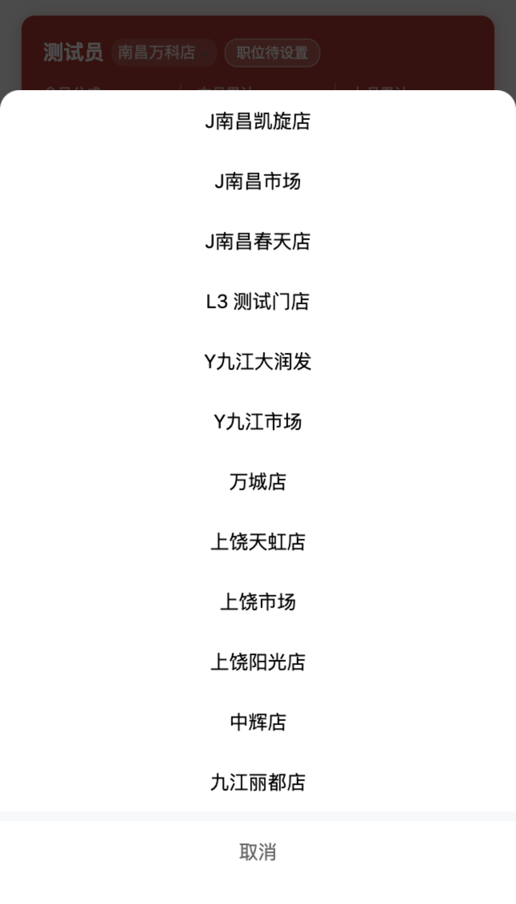

---

## 三、界面导览：底部五个入口

门店模式底部有 **5 个 Tab**：

| Tab | 作用 |
|-----|------|
| **工作台** | 今日/本月业绩、业绩日历、各类待办 |
| **开单** | 帮顾客开单（**店长**） |
| **服务** | 服务单：待服务 / 服务中 / 已完成 |
| **顾客** | 顾客搜索、分类统计、分配 |
| **我的** | 个人信息、快捷入口、退出 |

> 📷 截图占位：底部五个 Tab

---

## 四、工作台

工作台是你每天的第一屏，包含：

- **今日分成**：今日提成金额、订单数、服务数。
- **本月累计 / 上月对比**：累计提成与单量。
- **月度业绩日历**：按日期展示当月业绩，可点开看某天明细。
- **待办事项**（有数字角标提醒）：
  - 待确认预约
  - 待开始服务
  - 待确认线下收款
  - 待开单
  - 待解绑申请
  - 待分配（**店长**）
  - 待退款审批（**店长**）

> 💡 点待办项可直接跳到对应处理页。

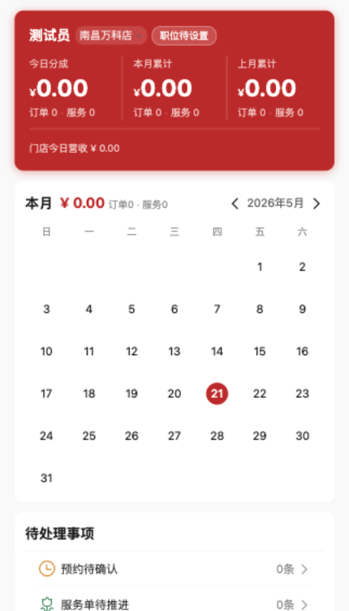

点「今日分成」可进入员工绩效明细：

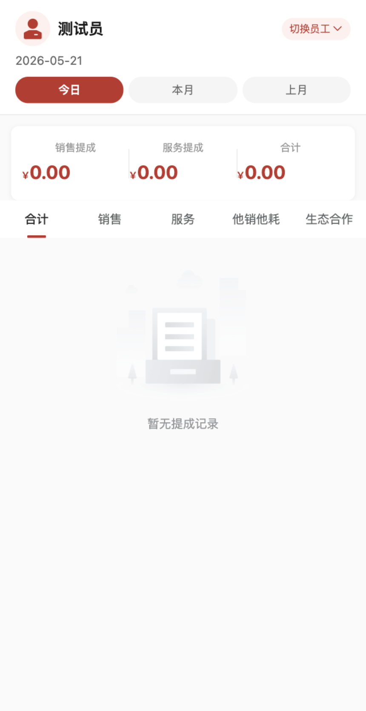

---

## 五、开单（店长）

> 仅**店长**可开单。路径：底部「**开单**」。

### 5.1 选商品

顶部按商品类型 4 选 1：

- **组合套餐**：一次性勾选套餐内多个项目。
- **普通商品**：左侧按分类，右侧选具体商品加入。
- **体验卡**：扁平列表，点「加入」。
- **充值卡**：跳到专门的充值开单页。

选好的商品进入**购物车**（可改数量、删除）。

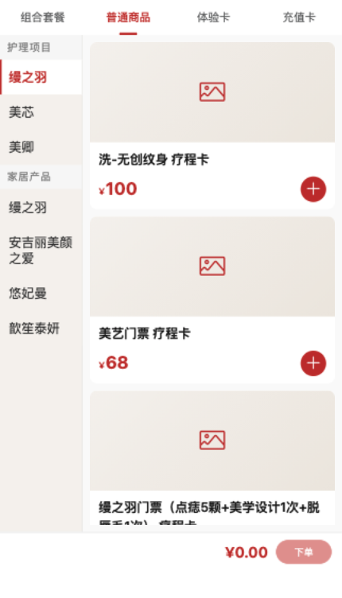

「充值卡」类型 → 充值卡开单页：

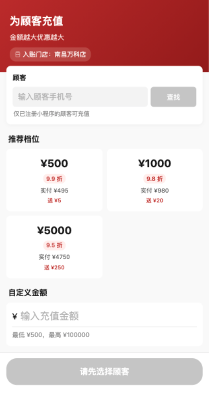

### 5.2 下单结算（4 步）

点「**下单**」进入 4 步结算：

1. **选择顾客**：搜索顾客姓名/手机号，或新建。
2. **选择商品**：复核购物车，可改数量、用优惠券。
3. **确认订单**：确认金额、选择订单类型/支付方式（店长可开内部单、转换单，可改实付金额）。
4. **完成**：生成订单，进入收款。

第 1 步「选择顾客」（在开单页点「下单」弹出）：

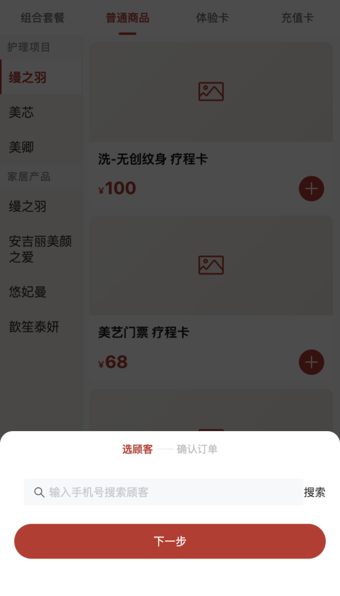

第 3 步「确认订单」（确认金额、储值卡抵扣、支付方式）：

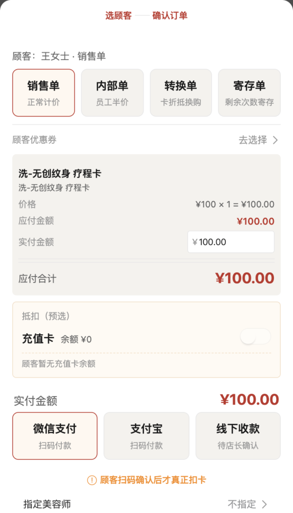

### 5.3 收款

- 下单后生成**收款二维码**，顾客用顾客端扫码完成支付（微信/支付宝/储值卡）。
- 若是**线下现金**收款，店长在订单详情点「**确认收款**」入账（支持部分收款）。

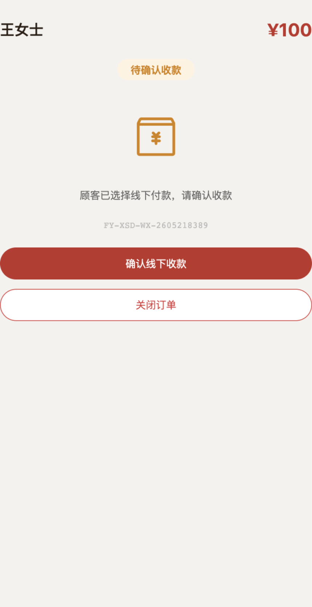

---

## 六、营业额分配（店长）

> 仅**店长**可分配。路径：「我的」→ 营业额分配，或工作台「待分配」待办。

订单**已支付后**，把每个商品的营业额按比例分给参与的员工：

1. 选「**技能标签**」（美容师 / 养生师 / 推广师）。
2. 选「**员工**」（该技能下、本店的在职员工）。
3. 选「**分配比例**」（10%、20% … 100%）。
4. 系统自动算出**提成比例、分配额、提成额**（只读）。
5. 一行最多分给 3 人；可对每个商品分别分配。
6. 点「**保存分配方案**」；若该单无需分配，点「**标记为无需分配**」。

营业额分配列表（销售提成 / 服务提成，按 待分配/已分配 筛选；点单进入逐项分配）：

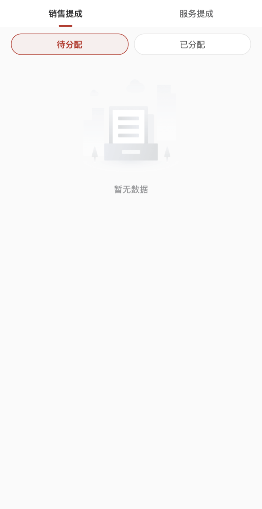

---

## 七、服务单（护理）

路径：底部「**服务**」。服务单有 3 个状态 Tab：**待服务 / 服务中 / 已完成**（待服务、服务中有数字角标）。

### 7.1 创建服务单

两种来源：

- **从预约转化**：预约到店后，从预约详情「开始服务」创建。
- **从付费订单**：选顾客已支付、有剩余次数的项目创建。

填写：服务项目、本次消费次数、服务人员（店长可指派给任意员工，普通员工默认自己）。

### 7.2 开始 / 完成服务

- 待服务 → 点「**开始服务**」→ 状态变"服务中"。
- 服务中 → 点「**确认完成**」→ 状态变"已完成"。
- **完成时系统自动扣减疗程卡次数，并自动生成服务提成。**

服务单历史列表：

---

## 八、预约

路径：「我的」→ 预约管理（或从工作台待办进入）。按状态筛选：**待确认 / 已确认 / 已完成 / 已取消 / 已关闭**。

- **待确认** → 点「确认」，状态变"已确认"。
- 顾客到店 → 点「**入店**」（签到）。
- 入店后可直接「创建服务单」转入服务流程。

---

## 九、顾客

路径：底部「**顾客**」。

- 顶部 **6 个统计卡**：活跃 / 即将流失 / 流失 / 沉睡 / 本月生日 / 下月生日。
- 统计栏：全部、会员客、流量客。
- **搜索**：按姓名或手机号查找。
- 点顾客进入**详情**：历史订单、联系方式、备注、会员等级等。
- **店长**可对顾客「**分配**」给指定员工。

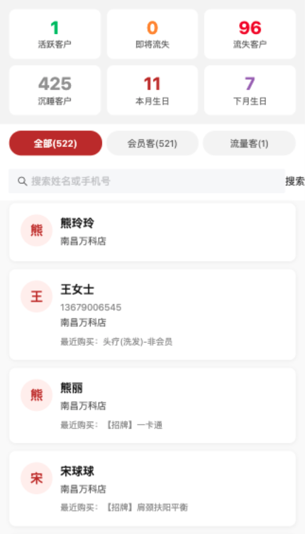

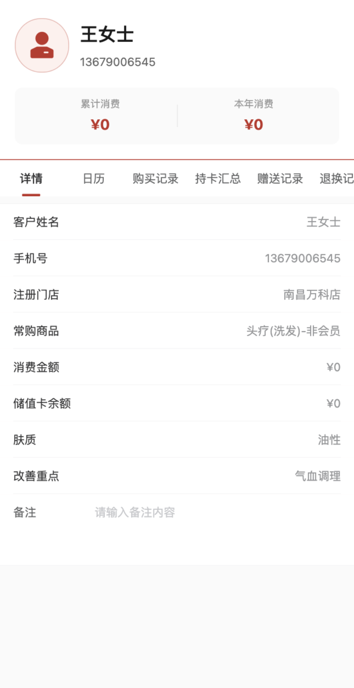

---

## 十、我的

路径：底部「**我的**」。

- **顶部**：头像、姓名、职位、所属门店（多门店可切换）。
- **手机号绑定**：显示已绑定手机号。
- **快捷入口**：
  - 订单管理
  - 预约管理
  - 营业额分配（**店长**）
  - 库存管理（**店长 / 管理员 / 财务**）
  - 提货核销（**店长**）
- **退出登录**。

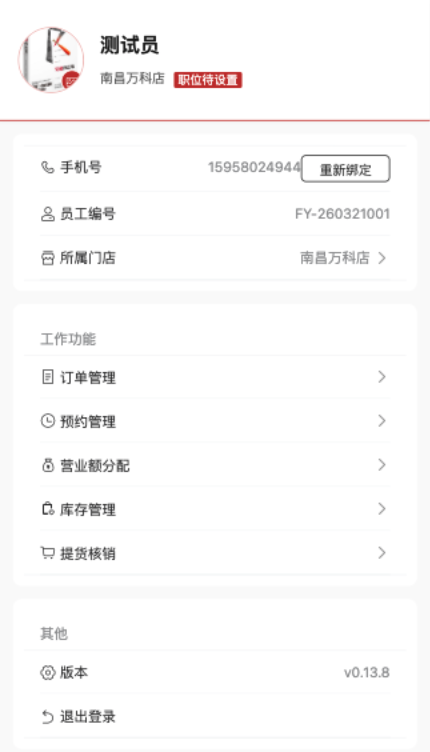

订单管理（从"我的"进入）：

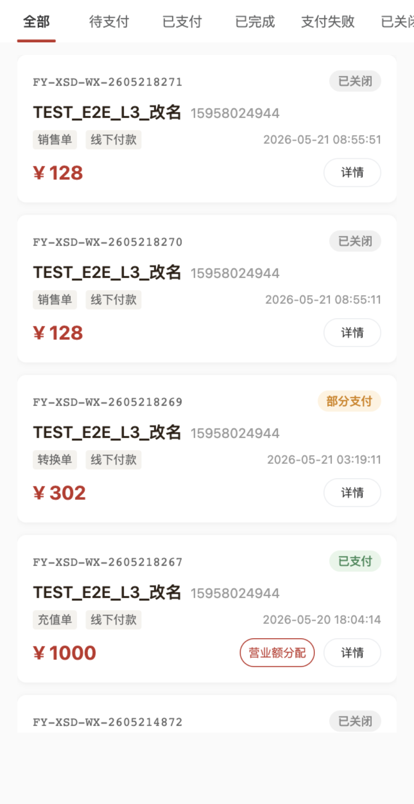

库存管理（店长 / 管理员 / 财务）：

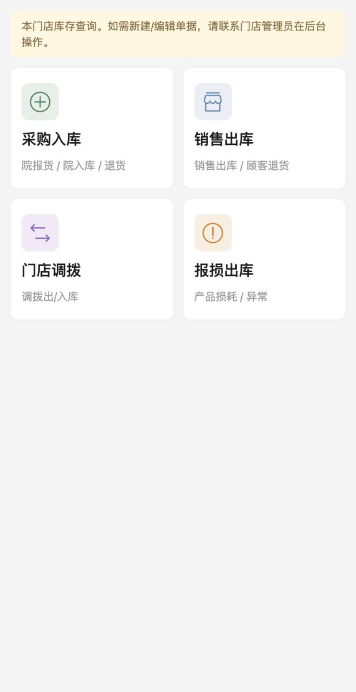

---

## 十一、退款流程

> 顾客**不能**自助退款，只能由店长在员工端发起、经理审批。

1. **店长发起退款**（订单详情）→ 状态变"待审批"。
2. **经理审批**通过 → 系统自动级联处理：作废相关营业额分配/服务提成、退回已用优惠券、冲减积分、回滚提货、储值卡支付部分自动回冲余额。
3. 若审批驳回，则退款作废。

---

## 十二、店长专属功能 vs 普通员工

| 功能 | 店长 | 普通员工 |
|------|:----:|:------:|
| 开单 / 改实付 / 内部单 / 转换单 | ✓ | ✗ |
| 确认线下收款 | ✓ | ✗ |
| 营业额分配 / 分配列表 | ✓ | ✗ |
| 退款发起与审批 | ✓ | ✗ |
| 充值卡开单 | ✓ | ✗ |
| 客户分配 | ✓ | ✗ |
| 提货核销 | ✓ | ✗ |
| 库存查看 | ✓（含管理员/财务） | ✗ |
| 创建/开始/完成服务单 | ✓ | ✓（自己的） |
| 预约确认 / 入店 | ✓ | ✓ |
| 查顾客 / 查个人订单 / 看工作台 | ✓ | ✓ |
| 申请退款 | ✓ | ✓（店长审批） |

---

## 十三、管理层模式（简述）

总部 / 市场层级的人员登录后选「**管理层**」，进入独立的管理层看板：

- **数据看板**：总业额、订单数、服务数、人均提成（可选总部/市场/门店范围）。
- **门店排名 / 员工排名**。
- **客流统计 / 产品周期 / 客户列表**。

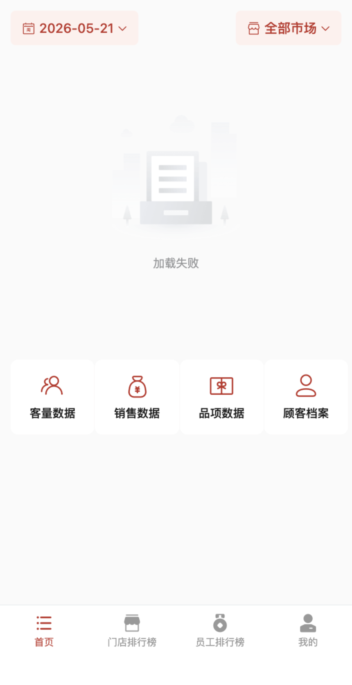

---

## 十四、常见问题

| 现象 | 多半原因 | 怎么解决 |
|------|---------|---------|
| 登录后看不到「开单」「分配」 | 你不是店长角色 | 这些是店长专属功能；需管理员在后台分配 manager 角色 |
| 看不到某门店的数据 | 当前门店选错 / 管辖范围不含 | 顶部切换门店，或找管理员核对权限范围 |
| 服务完成后次数没扣 | 未点"确认完成" | 必须点「确认完成」才扣次数并生成提成 |
| 提成显示 0 | 后台提成矩阵未配该档位 | 由管理员在后台「提成矩阵」补规则 |
| 顾客搜不到 | 顾客未注册/未绑定本店 | 确认顾客已在本店建档 |
| 收款确认不了 | 非店长 / 订单状态不对 | 线下收款由店长确认；线上支付自动到账 |

---

*本指南随小程序迭代更新，如与实际界面不符以实际为准。*
