# 凤御美业·小程序系统 使用手册

> 适用范围：本手册面向门店管理者与一线员工，指导你从零开始把系统用起来。
> 阅读顺序建议：**先读「第一部分：开业前的数据录入」并按顺序操作**，把基础资料一次性录全；再读「第二部分：日常业务流程」边用边查。
> 版本：v1.1 ｜ 最后更新：2026-08-22

---

## 目录

- [一、系统由哪三部分组成](#一系统由哪三部分组成)
- [二、开始前的准备](#二开始前的准备)
- [第一部分：开业前的数据录入（按顺序操作）](#第一部分开业前的数据录入按顺序操作)
  - [0. 登录管理后台 + 修改初始密码](#0-登录管理后台--修改初始密码)
  - [录入顺序总览](#录入顺序总览)
  - [1. 录入组织架构](#1-录入组织架构)
  - [2. 录入门店](#2-录入门店)
  - [3. 录入员工（含职位、技能标签）](#3-录入员工含职位技能标签)
  - [4. 分配权限](#4-分配权限)
  - [5. 录入品项分类](#5-录入品项分类)
  - [6. 录入商品（开单用）](#6-录入商品开单用)
  - [7. 录入商城分类（顾客端展示用）](#7-录入商城分类顾客端展示用)
  - [8. 配置商城（把商品挂上货架）](#8-配置商城把商品挂上货架)
  - [9. 配置提成矩阵](#9-配置提成矩阵)
  - [10. 创建优惠券（可选）](#10-创建优惠券可选)
  - [11. 配置会员权益](#11-配置会员权益)
  - [12. 系统配置](#12-系统配置)
  - [13. 配置拉卡拉收款商户](#13-配置拉卡拉收款商户)
  - [✅ 初始化完成自检清单](#-初始化完成自检清单)
- [第二部分：日常业务流程](#第二部分日常业务流程)
  - [A. 管理后台业务流程](#a-管理后台业务流程)
  - [B. 员工端小程序](#b-员工端小程序)
  - [C. 顾客端小程序](#c-顾客端小程序)
- [第三部分：问题反馈（Bug 上报）规范](#第三部分问题反馈bug-上报规范)
- [附录](#附录)

---

## 一、系统由哪三部分组成

整套系统分为 **三个入口**，分工如下：

| 入口 | 谁用 | 用来做什么 | 怎么打开 |
|------|------|-----------|---------|
| **管理后台**（网页） | 老板 / 店长 / 财务 / 人事 / 商品管理员 / 顾客管理员 | 录入基础资料、管理订单、查看报表、退款审批 | 电脑浏览器打开后台网址 |
| **员工端小程序** | 店长、美容师等门店员工 | 开单、收款、服务、预约、看业绩 | 微信扫「员工端」小程序码 |
| **顾客端小程序** | 顾客 | 浏览商品、下单、预约、充值、看积分/券 | 微信扫「顾客端」小程序码 |

**数据是怎么流动的（通俗版）：**

```
        管理后台（先把"家底"录进去）
   组织/门店/员工/商品/商城/优惠……
                  │
                  ▼
   员工端开单、服务  ←→  顾客端下单、预约、充值
                  │
                  ▼
        所有交易数据回到后台，
   报表、提成、会员等级自动算好
```

一句话：**管理后台是"地基"，没把基础资料录进去，员工端和顾客端就没东西可用。** 所以请务必先完成第一部分。

---

## 二、开始前的准备

- 一台能上网的电脑 + 浏览器（推荐 Chrome / Edge）。
- 管理后台网址：**http://118.178.196.26:3000/**
- 后台初始账号：**13617216903**，初始密码：**fengyu2026**（首次登录必须改密，见下文）。
- 两个小程序码（员工端、顾客端）——由我们提供，分发给员工和顾客扫码使用。
- 录门店时需要门店的「经纬度坐标」，用这个免费网站获取：**https://lbs.qq.com/getPoint/**（具体步骤见 [附录 C](#附录-c坐标怎么获取)）。

---

# 第一部分：开业前的数据录入（按顺序操作）

> ⚠️ **请严格按 0 → 12 的顺序录入。** 后面的步骤依赖前面的数据，跳着录会出现"选不到门店""选不到分类"等问题。

## 0. 登录管理后台 + 修改初始密码

1. 浏览器打开 **http://118.178.196.26:3000/**。
2. 输入手机号 **13617216903** 和初始密码 **fengyu2026**，点「登录」。
3. **首次登录系统会强制要求修改密码**：输入新密码并确认，提交后用新密码重新登录。请妥善保管新密码。

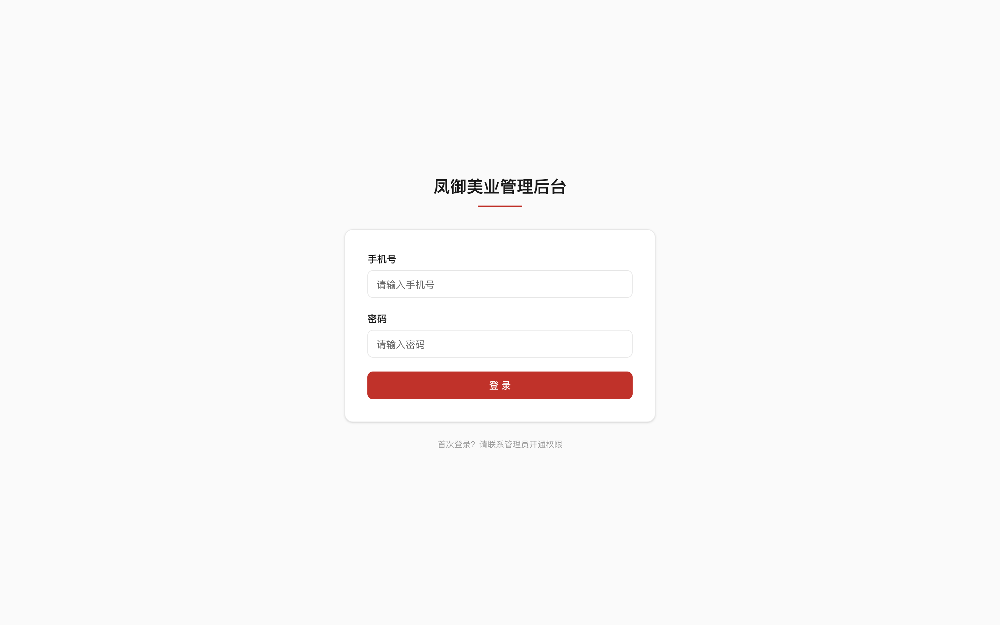

> 📷 截图占位：首次登录的"修改密码"页面（首次用初始密码登录时会出现此页；本手册采集截图时账号已改过密，此处留待你补图）

登录后进入「工作台」主界面：

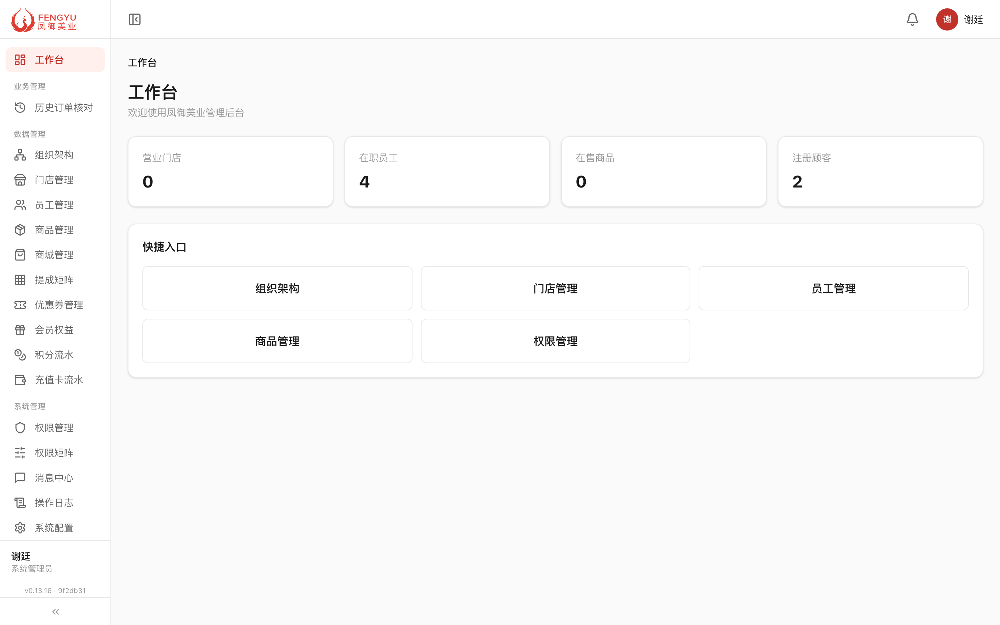

> 💡 左侧是功能菜单，分为四组：**工作台 / 业务管理 / 数据管理 / 系统管理**。本部分要用的录入功能，主要在「数据管理」和「系统管理」两组里。

---

## 录入顺序总览

| 顺序 | 在后台哪里录 | 录什么 | 为什么要先录它 |
|----|----|----|----|
| 1 | 数据管理 → 组织架构 | 总部、市场、门店、（部门） | 门店、员工都要挂在组织树上 |
| 2 | 数据管理 → 门店管理 | 每家门店的详细信息 | 员工、商品、订单都要归属到门店 |
| 3 | 数据管理 → 员工管理 | 职位、技能标签、员工 | 开单、服务、提成都要分到人 |
| 4 | 系统管理 → 权限管理 | 给员工分配角色和管辖范围 | 决定每个人能看到/操作哪些数据 |
| 5 | 数据管理 → 商品管理 → 品项分类 | 一级品项 + 二级分类 | 商品必须挂在分类下 |
| 6 | 数据管理 → 商品管理 | 商品（SKU） | **开单**时从这里选货 |
| 7 | 数据管理 → 商城管理 → 商城分类 | 顾客端商城的展示分类 | 顾客端商城商品要挂在商城分类下 |
| 8 | 数据管理 → 商城管理 | 商城展示商品（把商品挂上货架） | **顾客端小程序商城**展示用 |
| 9 | 数据管理 → 提成矩阵 | 各角色的提成比例 | 不配则提成算出来是 0 |
| 10 | 数据管理 → 优惠券管理 | 优惠券（可选） | 营销用 |
| 11 | 数据管理 → 会员权益 | 会员等级门槛和权益 | 系统据此自动判定会员等级 |
| 12 | 系统管理 → 系统配置 | 充值卡档位、首页轮播图等 | 充值、首页展示用 |

### 🔑 一定要分清：「商品管理」 vs 「商城管理」

这是最容易混淆、也最关键的一点：

| | 商品管理（`商品管理`菜单） | 商城管理（`商城管理`菜单） |
|---|---|---|
| 是什么 | 后台的"商品账本"（SKU） | 顾客端小程序的"前台货架" |
| 给谁看 | **店长/后台开单**时选货用 | **顾客**在小程序里浏览、自助下单时看到的 |
| 不配会怎样 | 开不了单 | 顾客端商城是空的 |

- 如果你**只做线下开单**（店长帮顾客开单），最少只配到「商品管理」即可。
- 如果你想让**顾客自己在小程序里浏览和下单**，就必须把商品挂到「商城管理」上（第 7、8 步）。
- ⚠️ **充值卡不是商品**，不要在这里建。充值卡只在第 12 步「系统配置」里设档位。

---

## 1. 录入组织架构

**路径：数据管理 → 组织架构**

组织架构是一棵"树"，自上而下四种节点：

```
总部（headquarters）—— 只建一个，是最顶层
  └── 市场（market）—— 如"华东大区""华北大区"，可多个
        └── 门店（store）—— 如"上海浦东店""北京西路店"，可多个
              └── 部门（department）—— 可选，如"护理部""财务部"
```

**操作步骤：**

1. 进入「组织架构」页，先确认/创建**总部**节点（一般系统已有一个，没有就新建）。
2. 在总部下「新增子节点」，类型选**市场**，填市场名称。
3. 在市场下「新增子节点」，类型选**门店**，填门店名称。
4. （可选）在任意层级下新增**部门**节点。

**每个节点要填：** 节点名称、节点类型、上级节点（总部以外都要选）、排序号、是否启用。

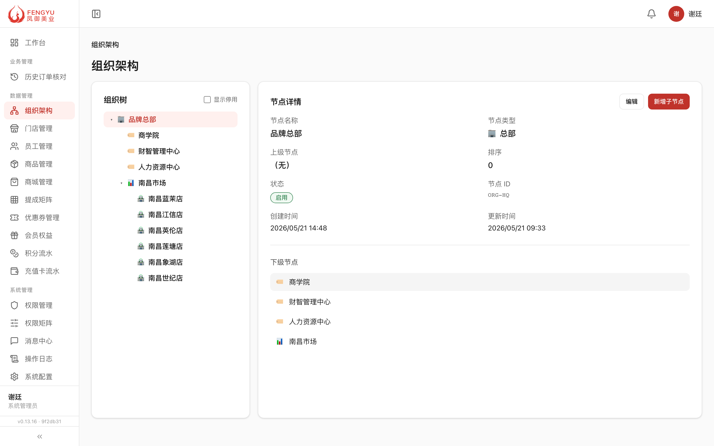

> 💡 这里建的"门店"节点只是树上的一个位置；门店的电话、地址、图片等详细信息在下一步「门店管理」里补。

---

## 2. 录入门店

**路径：数据管理 → 门店管理 → 新建门店**

为上一步建的每个门店补全详细信息。

**必填：**
- 门店名称（要唯一，不能和别的门店重名）
- 所属市场（从第 1 步建的市场里选）

**建议填写：**
- **基本信息**：联系电话、开业日期、床位数、营业时间（如 `09:00-21:00`）
- **地理位置**：省/市/区、详细地址、**纬度、经度**（见下方）、停车信息
- **展示内容**：门店简介、公告、**封面图**、**门店图片**（最多 9 张）

**关于经纬度坐标（顾客端"附近门店"定位要用）：**

1. 打开 **https://lbs.qq.com/getPoint/**
2. 在搜索框输入门店地址，地图上会出现一个标记点。
3. 页面会显示这个点的坐标，格式是 `纬度,经度`（如 `31.2304,121.4737`）。
4. 把**纬度**填进"纬度"框，**经度**填进"经度"框。
   （详细图解见 [附录 C](#附录-c坐标怎么获取)）

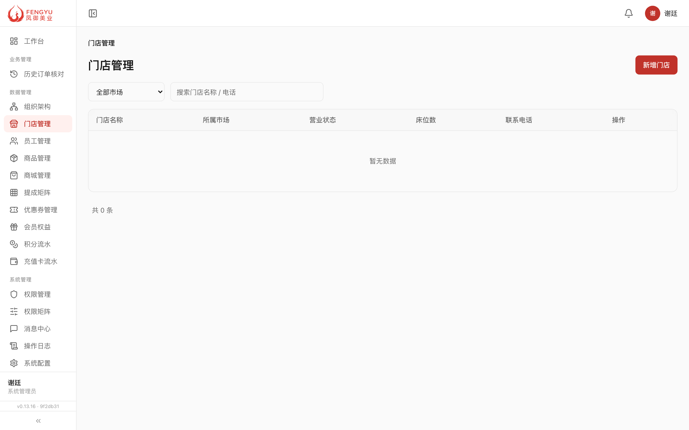

新建门店表单（注意"纬度/经度"和图片上传区域）：

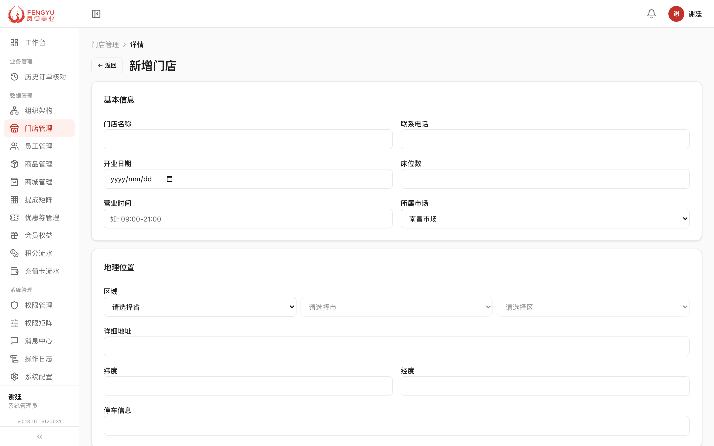

---

## 3. 录入员工（含职位、技能标签）

**路径：数据管理 → 员工管理**

> 录员工前，**先在本页右上角的两个小工具里**，把"职位"和"技能标签"建好，否则录员工时选不到。

### 3.1 先建「职位」

1. 在员工管理页右上角点「职位管理」按钮，打开弹窗。
2. 弹窗里按"总部 / 市场 / 门店"分页，点「新增职位」，填职位名（如"店长""美容师""顾问"）和排序。

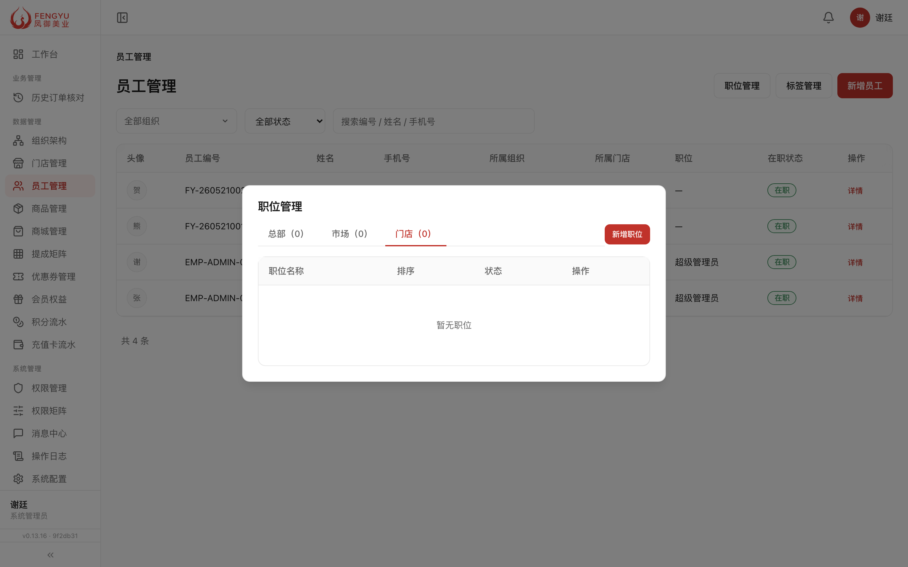

### 3.2 再建「标签」（技能标签）

1. 在员工管理页右上角点「标签管理」按钮，打开弹窗。
2. 新增标签，如"美容师""养生师""推广师"（这些标签在**营业额分配**时用来选可分配的人）。

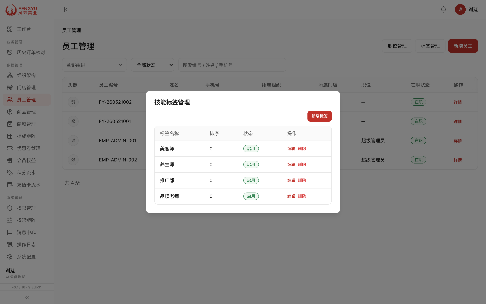

### 3.3 录入员工

**路径：员工管理 → 新增员工**

**必填：** 姓名、手机号（11 位）。

**建议填写：**
- 基本档案：性别、身份证号、生日、头像
- 组织归属：所属组织节点、所属门店、**职位**（按所属层级自动过滤）、技能标签（可多选）
- 聘用信息：入职日期、（离职时再填）离职日期

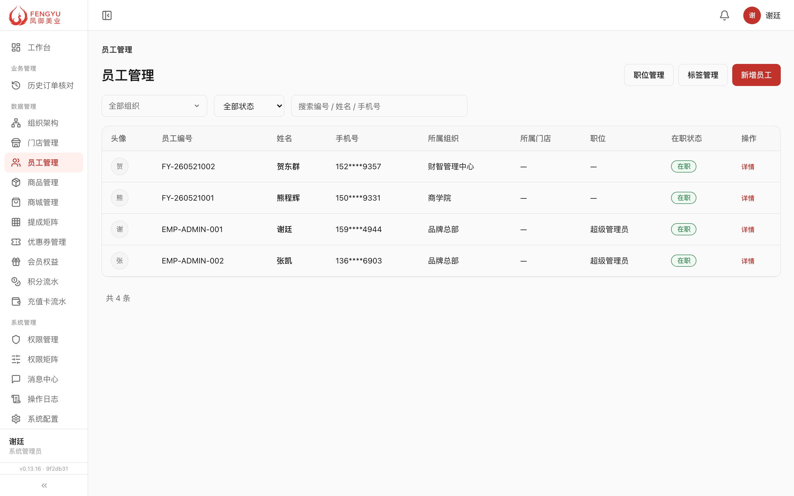

新增员工表单：

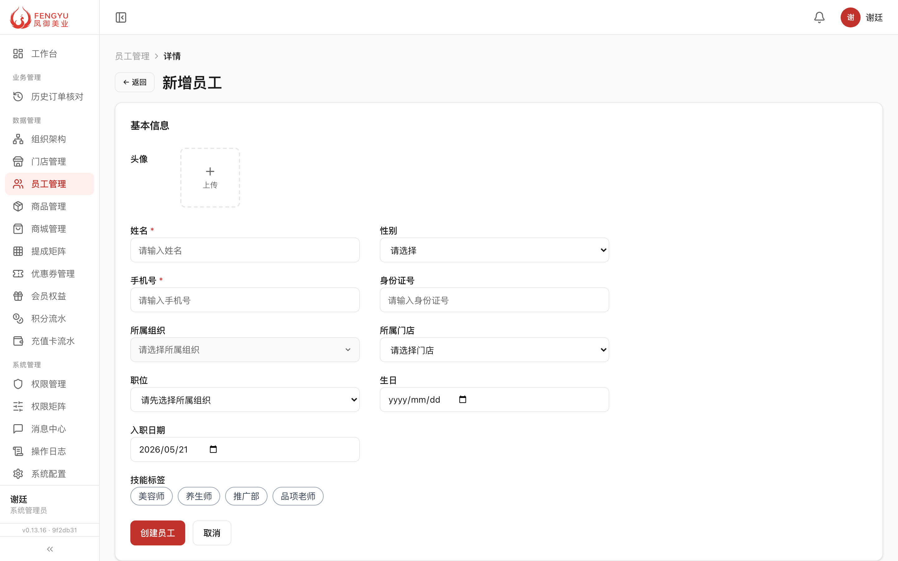

> 💡 **员工怎么登录员工端？** 员工不需要单独注册：在后台录好员工（手机号是关键）后，员工用微信扫「员工端」小程序码，授权手机号登录，系统按手机号自动匹配到他的档案和权限。

---

## 4. 分配权限

**路径：系统管理 → 权限管理**

录好员工后，要给他们分配**角色 + 管辖范围**，决定每个人能看到和操作哪些数据。

**操作：** 选员工 → 选角色 → 选管辖范围（总部 / 某市场 / 某门店）→ 提交。一个员工可以有多个"角色 + 范围"组合。

**六种角色（详见 [附录 A](#附录-a角色权限速查表)）：**

| 角色 | 通俗说明 |
|------|---------|
| 系统管理员（admin） | 全系统权限，负责基础资料和权限管理 |
| 店长（manager） | 门店业务：开单、订单、营业额分配、退款发起/审批 |
| 财务（finance） | 看订单、流水（只读） |
| 人事（hr） | 管组织、员工、权限 |
| 商品管理员（product） | 管商品、分类、优惠券 |
| 顾客管理员（customer_mgr） | 管顾客档案、疗程卡、券 |

**管辖范围（范围决定能看到多少数据）：**
- 选**总部** → 能看全部门店数据
- 选**某市场** → 只能看该市场下的门店
- 选**某门店** → 只能看这一家门店

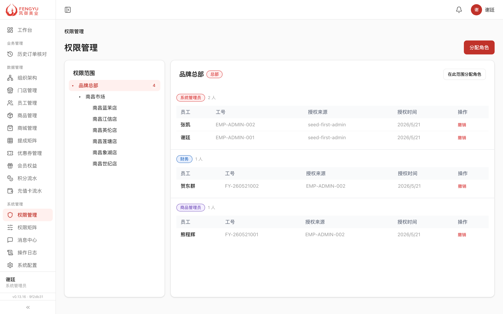

> 💡 **常见疑问**：员工反映"看不到订单/顾客"，通常是这里的管辖范围设小了或没分配相应角色。

---

## 5. 录入品项分类

**路径：数据管理 → 商品管理 → 品项分类**

商品必须先有分类才能录。分类分两级：

- **一级分类（品项）**：如"护理项目""家居产品""充值卡""体验卡"。每个一级分类可设展示色和排序号。
- **二级分类**：挂在某个一级分类下，如"招牌护理""王牌护理"。二级分类要选一个**经营分类**（自销自耗 / 他销自耗 / 他销他耗 / 生态合作），它会影响后面的提成计算。

**操作：** 先建一级分类，再在其下建二级分类。

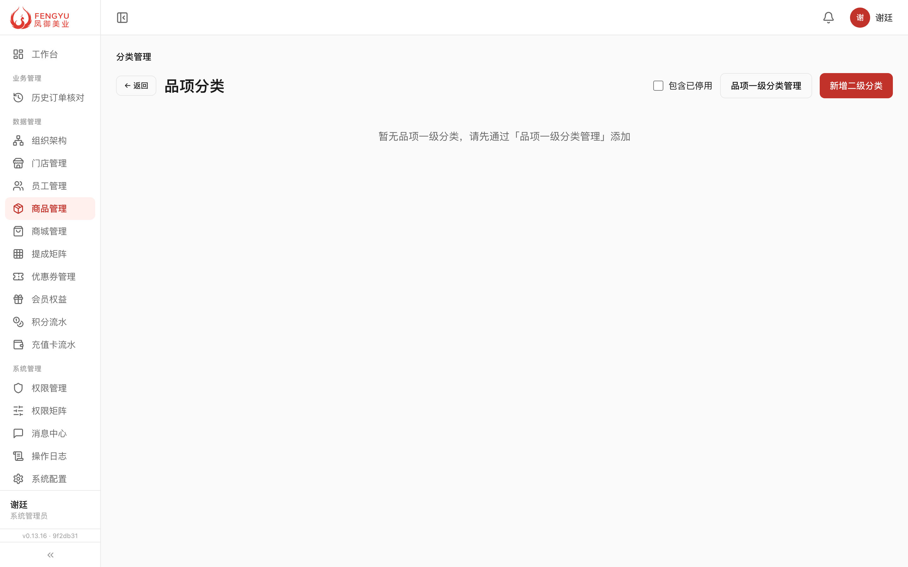

---

## 6. 录入商品（开单用）

**路径：数据管理 → 商品管理 → 新增商品**

这里建的是 **SKU（最小销售单位）**，是**开单时选的货**。

**主要字段：**

| 字段 | 说明 |
|------|------|
| 商品名称 | 完整规格名，如"蜜语水润嫩肤护理 10 次卡" |
| 品项分类 | 选到第 5 步建的**二级分类**（一级→二级联动选） |
| 产品类型 | 疗程卡 / 家居产品 |
| 标价 | 零售价 |
| 会员价 | 可空 |
| 次数 | 疗程卡填次数（单次填 1，多次如 10）；家居可不填 |
| 服务费 | 默认 0，按次收的服务费 |
| 可见范围 | 限定哪些市场可见，留空=全部可见 |
| 项目系列 | **可选**，默认留空即可 |
| 是否启用 | 关闭后开单时选不到 |


新增商品表单：

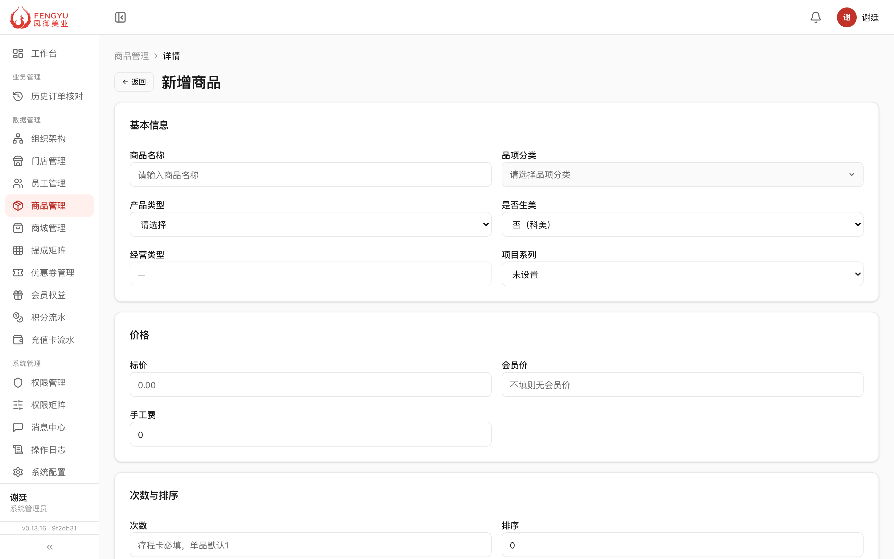

> 💡 商品的价格、次数都直接存在这里，开单时系统自动按这里的设置计价。

---

## 7. 录入商城分类（顾客端展示用）

**路径：数据管理 → 商城管理 → 商城分类**

> 这一步开始配置**顾客端小程序商城**。商城有自己的一套展示分类（和第 5 步的"品项分类"是两套，互不影响）。

**操作：** 新增商城分类，如"明星项目""居家护理""新人专享"。这些分类决定顾客在小程序商城里看到的导航。

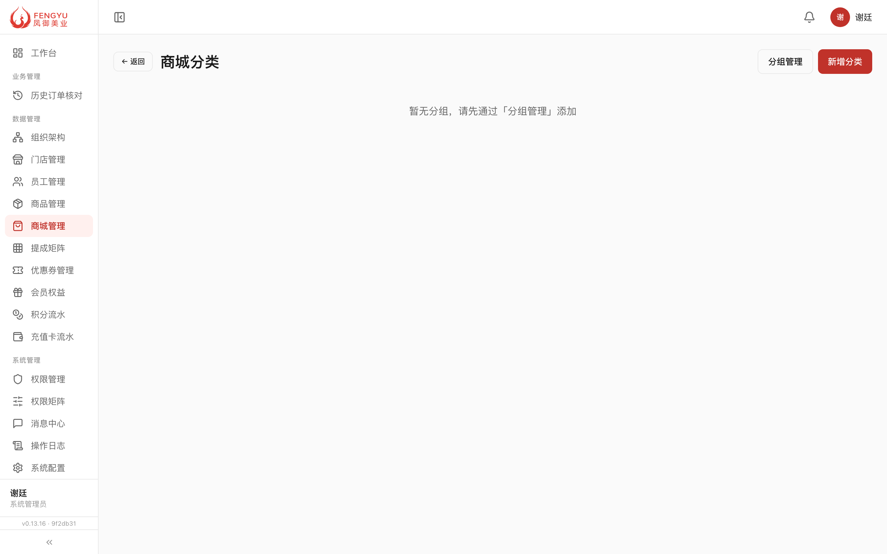

---

## 8. 配置商城（把商品挂上货架）

**路径：数据管理 → 商城管理 → 新建**

把第 6 步建的商品（SKU）挂到商城上，顾客端商城才会有东西展示。

**操作：**
1. 新建商城商品，填名称、选**商城分类**（第 7 步建的）、上传图片、写简介。
2. 关联对应的 **SKU**（一个商城商品可关联一个或多个 SKU 作为规格）。
3. 设展示价、是否上架。

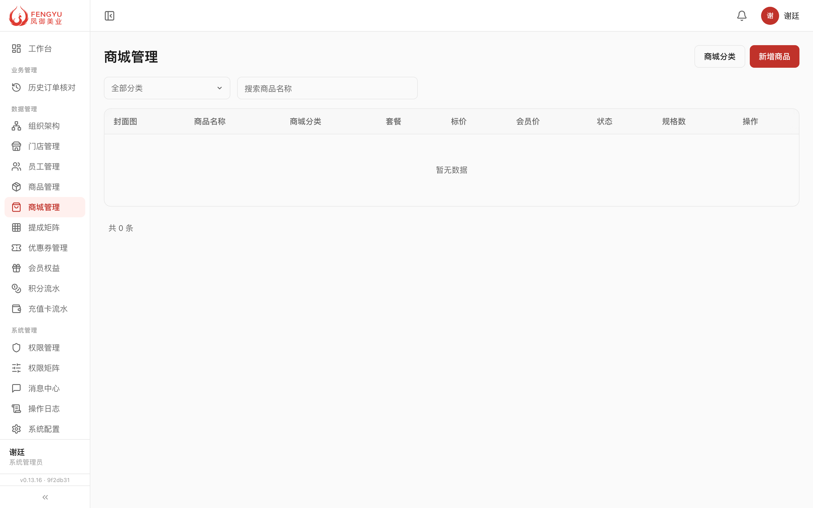

新建商城商品（关联 SKU）：

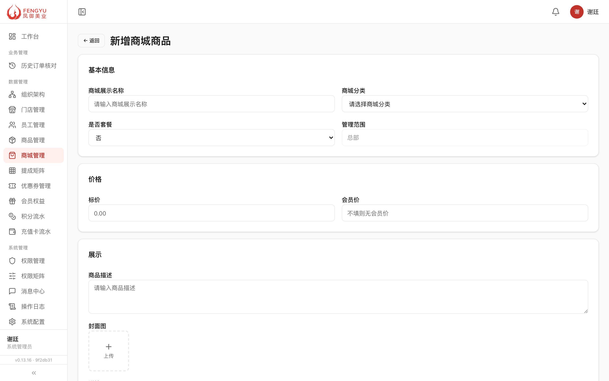

> ⚠️ **重要**：如果跳过第 7、8 步，顾客打开小程序商城会是空的。只有挂上货架的商品，顾客才看得到、才能自助下单。

---

## 9. 配置提成矩阵

**路径：数据管理 → 提成矩阵**

定义"不同角色、不同销售类别、不同金额档位"下的提成比例。**不配的话，提成会算成 0。**

**每条规则填：**

| 字段 | 说明 |
|------|------|
| 市场 | 可空（=全市场通用） |
| 订单类型 | 销售单 / 内部单 / 转换单 / 寄存单 |
| 角色类型 | 对应分配时的技能角色 |
| 经营分类 | 自销自耗 / 他销自耗 / 他销他耗 / 生态合作 |
| 金额档位（起、止） | 如 0~4999、5000~9999、≥10000 |
| 提成比例 | 如 10% |

**示例：** 销售单 + 自销自耗，0~4999 提 10%，5000~9999 提 12%，≥10000 提 15%。

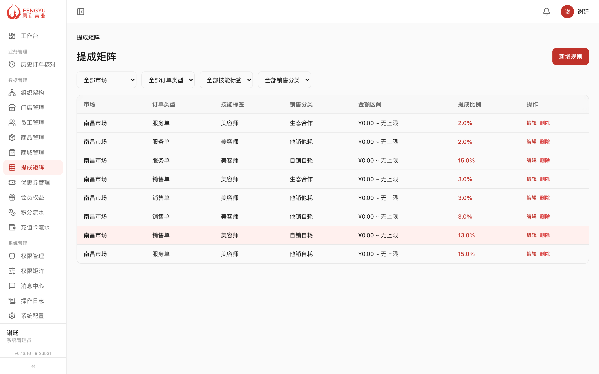

---

## 10. 创建优惠券（可选）

**路径：数据管理 → 优惠券管理 → 新增优惠券**

如需做营销活动可配，不需要可跳过。

**主要字段：** 名称、类型（现金券/品项券/折扣券）、优惠值、最低消费、最高优惠、发放数量、适用商品/分类/门店/市场、有效期、是否启用。

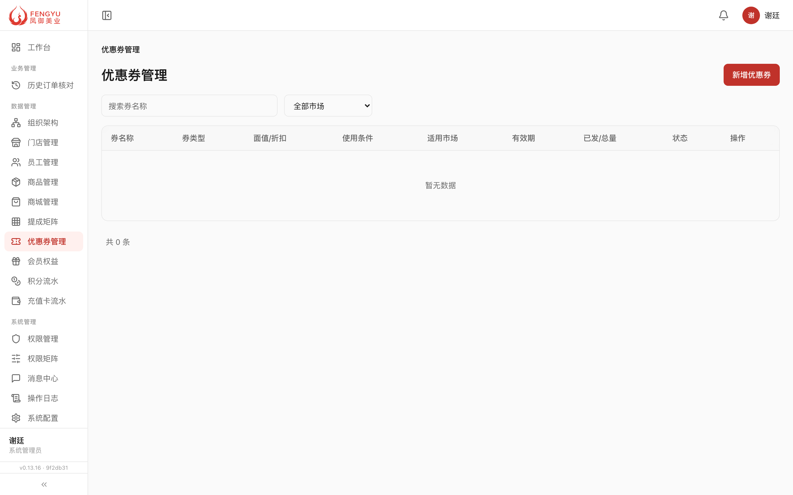

新增优惠券表单：

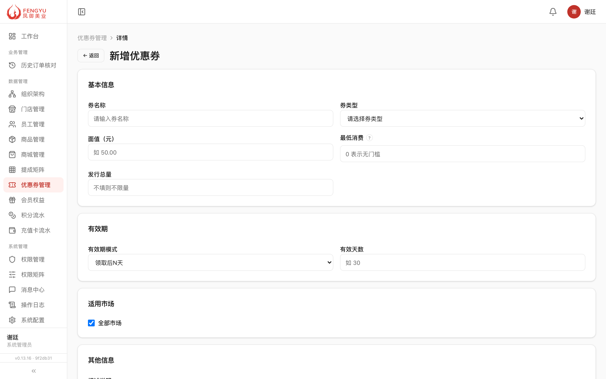

---

## 11. 配置会员权益

**路径：数据管理 → 会员权益**

设定会员等级门槛和对应权益（生日权益、感恩节权益等）。

> 💡 **重要：会员等级是系统自动算的，你不用手动给顾客升级。** 系统每天凌晨会按顾客最近 12 个月的消费额，自动判定/调整会员等级，并自动发放升级权益（券、积分等）。你在这里**只需把规则设好**即可。

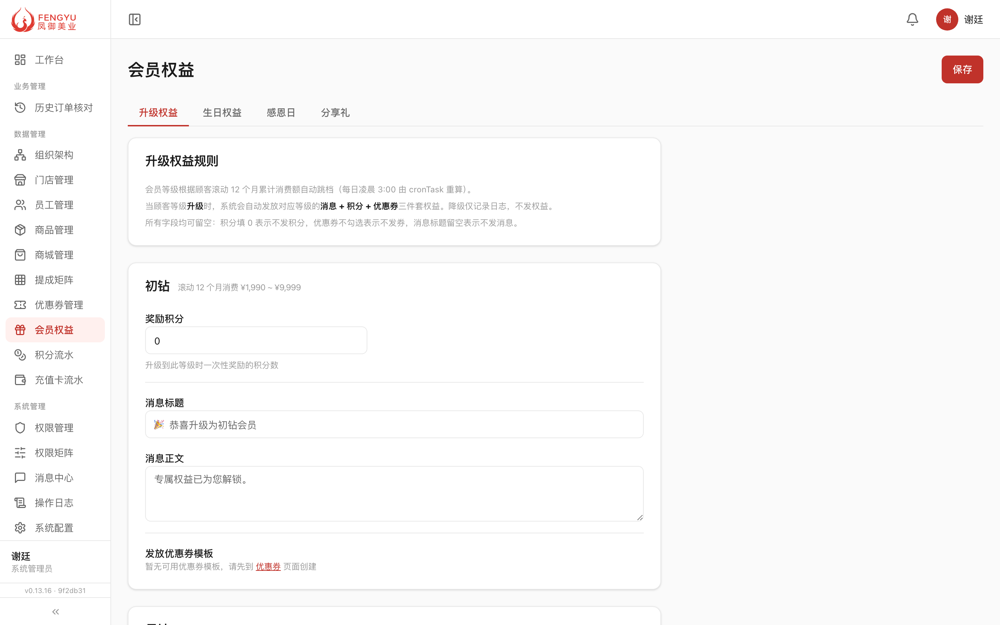

---

## 12. 系统配置

**路径：系统管理 → 系统配置**

分多个 Tab 配置全局参数：

- **充值卡配置**：设充值**档位**（面额 + 实付，如"充 1000 到账 1000、充 5000 实付 4500"）+ 最低充值金额 + 单次上限。
  ⚠️ 充值卡在这里配档位即可，**不要去"商品管理"里建充值卡**。
- **基础配置**：新会员消费门槛（首次消费达标自动成为会员）、订单超时时间（待支付订单多久自动关闭）。
- **首页轮播图**：上传顾客端小程序首页的轮播图（可多张、可排序）、凤御馆宣传图。

充值卡配置 Tab：

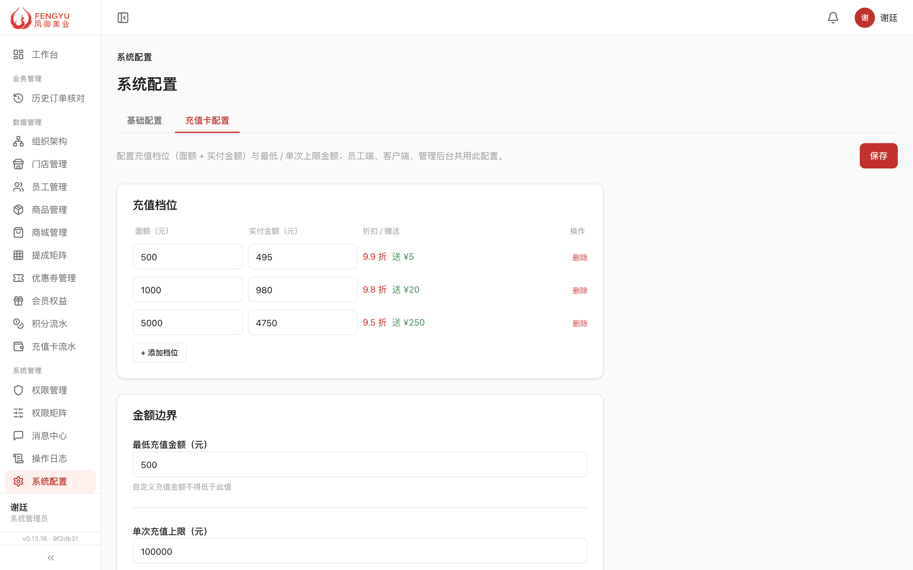

基础配置 / 首页轮播图 Tab：

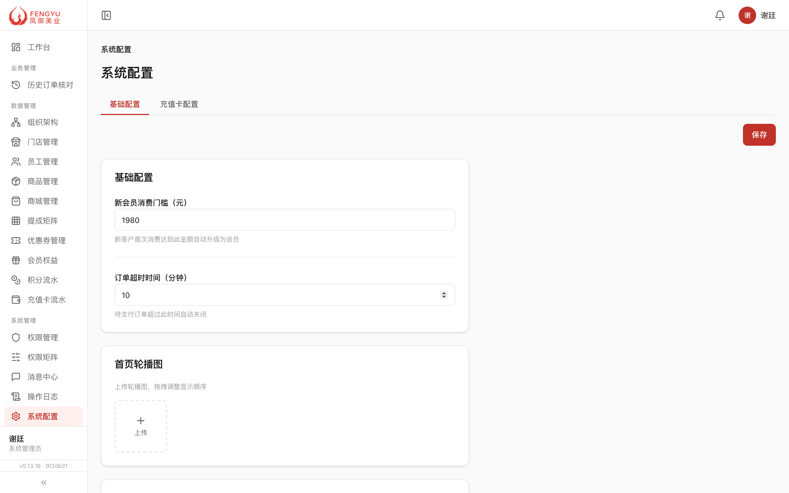

---

## 13. 配置拉卡拉收款商户

**适用对象：系统管理员。** 此功能用于为新门店办理拉卡拉入网、关联收款商户并启用真实支付；员工端不能办理这些操作。

> ⚠️ **入网申请通过，不等于门店已经可以真实收款。** 还必须取得商户号、终端号，完成微信/支付宝认证（如系统提示），并在「收款商户」中启用后才生效。

### 13.1 先分清两个页面

路径：**数据管理 → 商户管理**。

| 页面 | 用途 | 何时处理 |
|------|------|----------|
| **入网申请** | 为门店发起入网、上传资料、签约、提交审核与查询状态 | 新开门店，或主体/结算信息发生变更时 |
| **收款商户** | 查看已落地的拉卡拉商户、关联门店并启用真实支付 | 收到商户号和终端号后 |

### 13.2 发起申请与准备资料

1. 进入「商户管理 → 入网申请」，点击「为门店发起入网」。
2. 先选择**正确的门店**再创建申请；同一门店同时只能有一条进行中的申请。
3. 按页面要求上传营业执照、法人身份证正面、开户许可证，以及门头照、内景照、收银照等门店现场资料。
4. 单个文件不超过 5 MB；资料仅用于入网，请不要通过群聊或非受控渠道转发。

### 13.3 核对 OCR 与填写资料

- OCR 只用于辅助填写。提交前必须人工核对营业执照主体、统一社会信用代码、法人姓名/证件号、注册地址及结算账户。
- 联系人默认应填写法人；不要用店长或其他人员替代，除非实际材料另有规定。
- 详细地址填写省、市、区以后的门牌、楼栋、房号等内容，避免与前面的地区选择重复。
- 结算账户须使用拉卡拉受理结果认可的信息：结算户名、银行卡号、开户行所在地和开户支行。选择支行时必须从搜索结果中点选，不要只手工输入文字。

### 13.4 签约、提交与状态查询

1. 使用营业执照对应的法人本人完成电子签约。
2. 签约完成后再提交拉卡拉审核；提交成功表示“已受理”，不代表真实支付已可用。
3. 在申请详情页持续查看状态，等待返回银联商户号、终端号及微信/支付宝子商户相关结果。
4. 如页面提供认证指引，按指引完成微信/支付宝外部认证；未完成时不要把申请误判为最终完成。

### 13.5 关联门店并启用真实收款

1. 取得必要编号并完成认证后，在申请详情页完成“关联收款商户”的操作。
2. 切换到「收款商户」，核对商户名称、商户号、终端号和关联门店均正确。
3. 打开该商户，勾选「已启用（调用真实拉卡拉接口）」并保存。
4. 启用后用一笔**小额真实交易**验证门店收款链路；未完成验证前，不要把门店当作已正式开通。

### 13.6 办理前自检与常见问题

| 检查项 | 要求 |
|------|------|
| 门店 | 已选对申请门店 |
| 联系人 | 与法人及提交材料一致 |
| 地址 | 已去除重复的省、市、区信息 |
| 开户支行 | 已从搜索结果中选中正确支行 |
| 电子签约 | 已由法人完成 |
| 商户/终端编号 | 已返回且已核对 |
| 收款启用 | 已关联门店，并在「收款商户」中启用 |

**遇到“待终端号”或“待认证”时：** 这通常表示流程尚未全部结束。先在申请详情页查询最新状态、完成外部认证；不要重复发起新的入网申请。

---

## ✅ 初始化完成自检清单

**最小可用（仅线下开单）：**

- [ ] 已用新密码登录后台
- [ ] 组织架构：总部 / 市场 / 门店 都已建
- [ ] 门店详细信息已填（含坐标）
- [ ] 职位、技能标签已建
- [ ] 员工已录入
- [ ] 已给店长等关键员工分配角色和管辖范围
- [ ] 品项分类（一级 + 二级）已建
- [ ] 商品（SKU）已建，且"是否启用"为开
- [ ] 提成矩阵已配（否则提成为 0）

**顾客端线上完整可用（在上面基础上追加）：**

- [ ] 商城分类已建
- [ ] 商城商品已上架并关联 SKU
- [ ] 系统配置：充值档位、首页轮播图已设
- [ ] 会员权益规则已设
- [ ] （可选）优惠券已建

**使用拉卡拉真实线上收款（在上面基础上追加）：**

- [ ] 已完成门店拉卡拉入网、电子签约和审核
- [ ] 已取得并核对商户号、终端号
- [ ] 已完成系统要求的微信/支付宝认证
- [ ] 已关联正确门店并在「收款商户」中启用
- [ ] 已完成一笔小额真实收款验证

---

# 第二部分：日常业务流程

> 本部分讲资料录完后的日常运营。同一件事（如开单）可能在多个入口都能做，下面会标明"谁、在哪做"。

## A. 管理后台业务流程

### A1. 开单

开单有**三个入口**，请按门店实际情况选用：

| 入口 | 谁 | 场景 |
|------|----|----|
| **员工端小程序**（主） | 店长 | 门店日常帮顾客开单，最常用 |
| **管理后台** | 经理 | 后台补录、特殊单据 |
| **顾客端小程序** | 顾客本人 | 顾客自助下单 |

后台开单路径：**业务管理 → 开单**。选顾客 → 选商品 → 分配服务人员 → 提交。

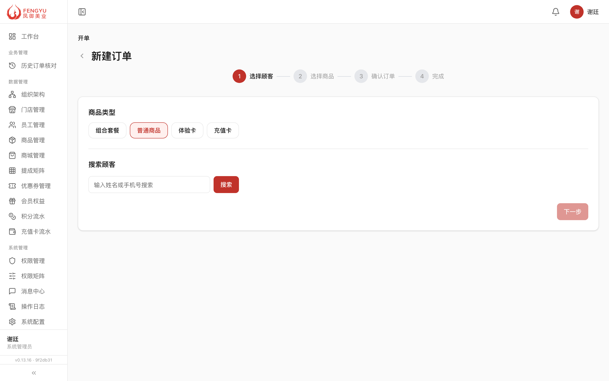

### A2. 收款确认

- **线上支付（微信 / 支付宝）**：顾客扫码支付后，系统**自动**确认到账，无需人工操作。
- **线下支付（现金等）**：由**店长 / 经理**手动确认收款（后台「订单管理」里可"记录收款"，支持部分收款）。

> 💡 规则：订单创建时一律是"待支付、实收 0"，**先收钱、再记账**。

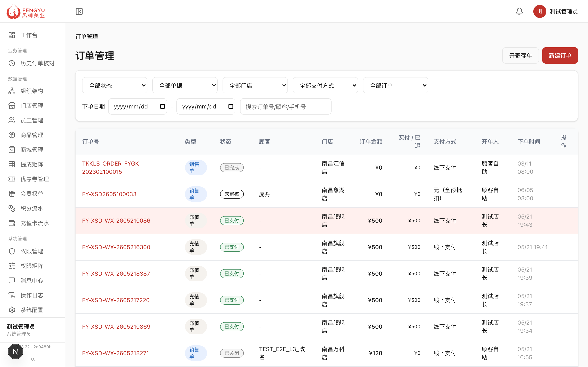

### A3. 营业额分配

**路径：业务管理 → 营业额分配** ｜ **谁：店长 / 经理** ｜ **时机：订单已支付后**

把订单里每个商品的营业额，按比例分配给参与的员工（一行最多分给 3 人）。

- 选技能角色（如美容师）→ 选有该技能的员工 → 选分配比例。
- 提成比例由系统按「提成矩阵」自动带出（只读）。
- 可点"建议"自动预填一份分配方案再调整。

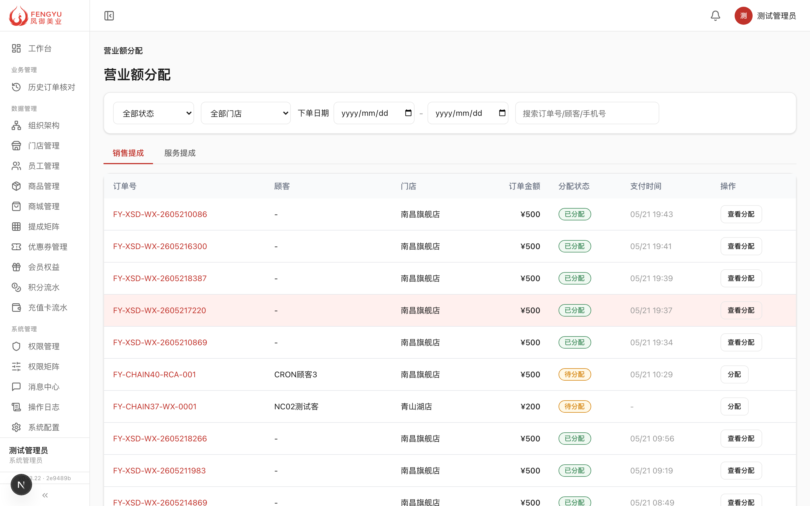

### A4. 服务单管理

**路径：业务管理 → 服务单管理**

服务单生命周期：**待服务 → 服务中 → 已完成**。

- 来源：可由「预约」入店后转化，或从顾客的"已付费疗程卡"创建。
- 员工"开始服务"→"完成服务"。**完成时系统自动扣减疗程卡次数，并自动产生服务提成。**

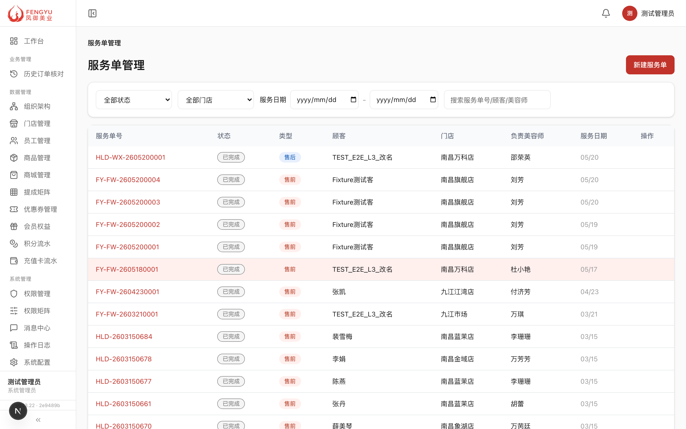

### A5. 服务提成分配

服务提成和"营业额分配"是**两回事**：营业额分配分的是商品收入；服务提成分的是**服务费**，在**服务单完成时自动产生**，需要时也可在后台手工调整。

### A6. 预约管理

**路径：业务管理 → 预约管理**

顾客在小程序提交预约后，门店在这里**确认**预约、顾客到店后**入店（签到）**，随后可转为服务单。

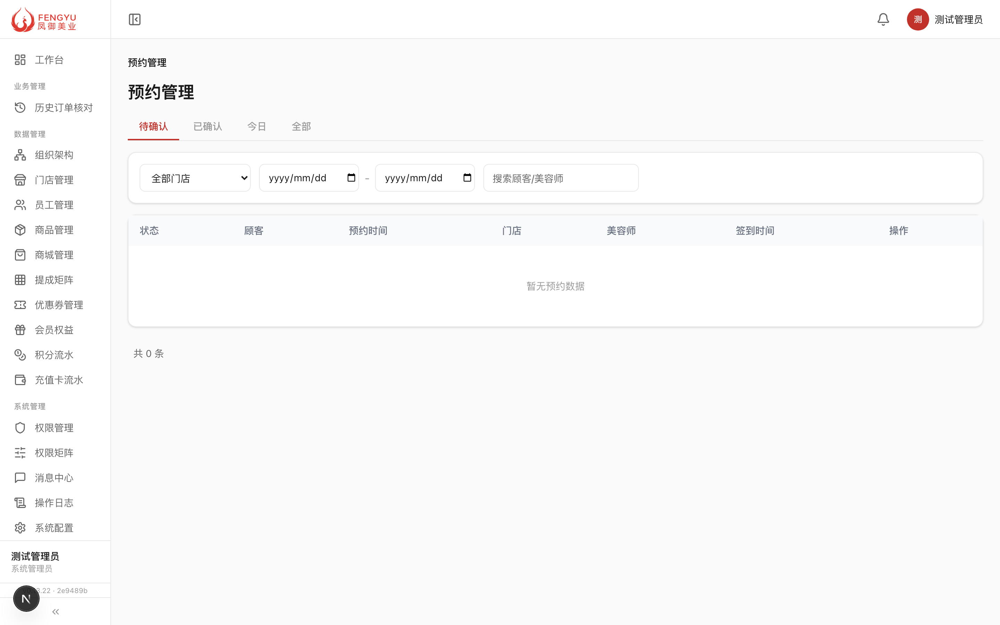

### A7. 退款流程

**路径：业务管理 → 退款（/refunds）** ｜ 顾客**不能**自助退款。

完整流程：

```
店长/经理发起退款
      │（状态：待审批）
      ▼
经理审批
      │
      ▼
系统自动级联处理：
  · 作废相关的营业额分配、服务提成
  · 退回已使用的优惠券
  · 反向冲减已得积分
  · 回滚已确认的提货记录
  · 储值卡支付的部分，余额自动回冲
```

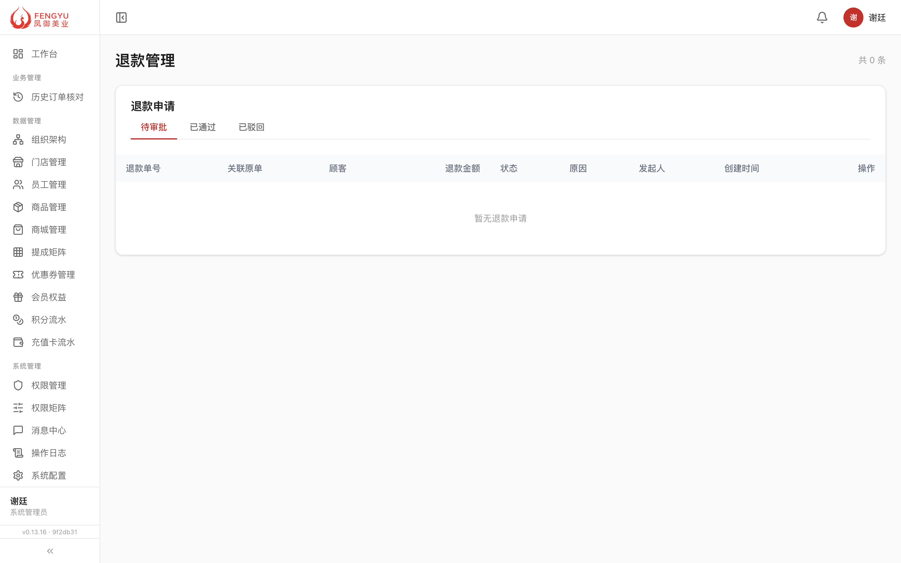

### A8. 顾客管理 / 疗程卡 / 门店解绑

- **顾客管理**（数据管理 → 顾客管理）：查档案、分类统计、标签、备注、绑定员工。
- **疗程卡管理**（数据管理 → 疗程卡管理）：查顾客充值卡、消费记录。
- **门店解绑**（业务管理 → 门店解绑）：审批顾客在小程序发起的"换绑门店"申请。

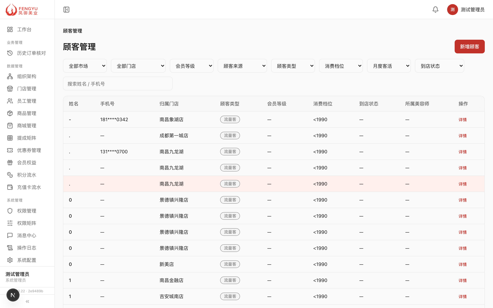

疗程卡管理页面：

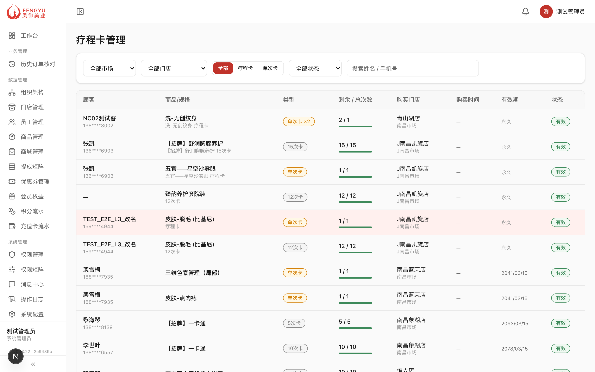

### A9. 提货记录 / 门店库存（日常录入）

- **提货记录**（业务管理 → 提货记录）：登记家居产品类商品的提货。
- **门店库存**（业务管理 → 门店库存）：进货、销售、调拨、报损四类单据的日常登记。

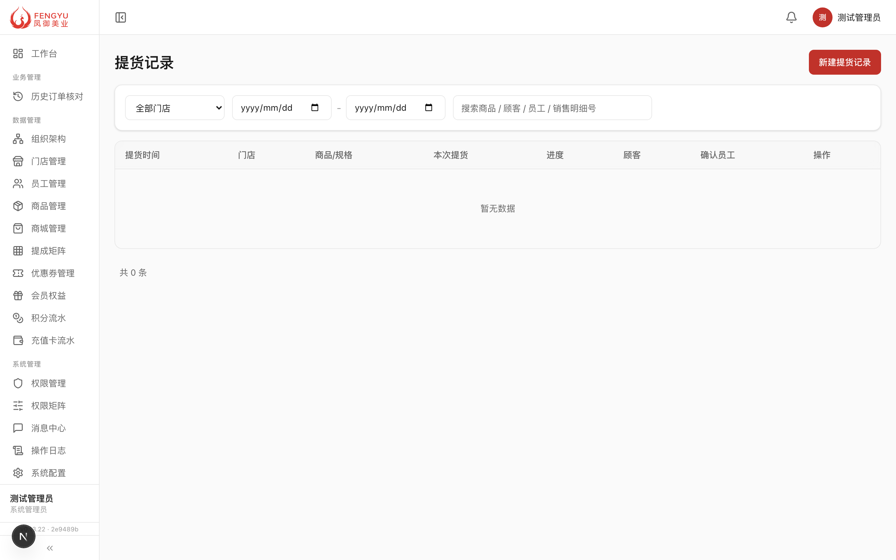

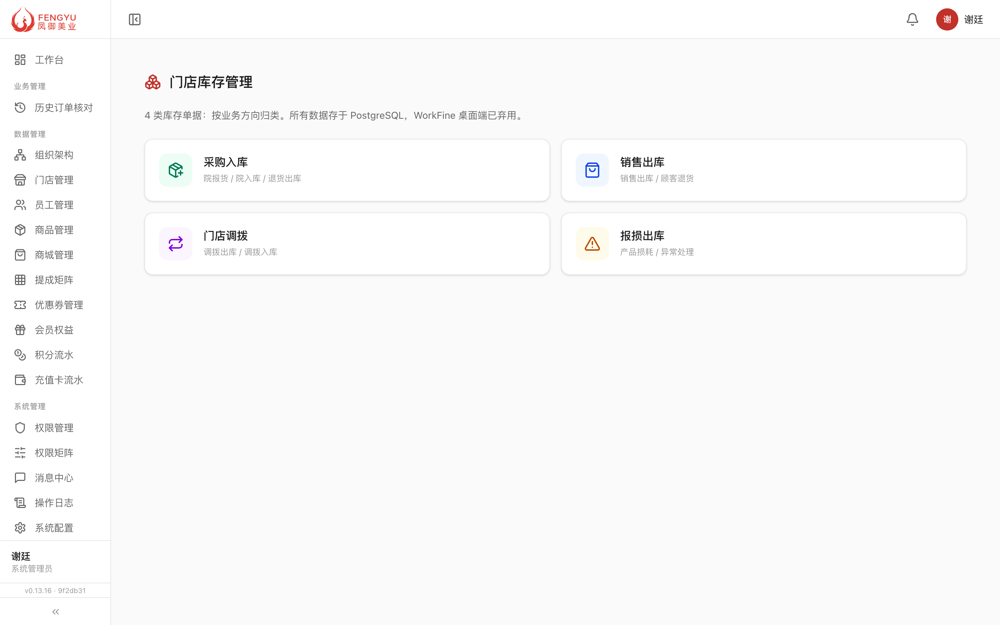

### A10. 流水查询 / 操作日志

- **积分流水 / 充值卡流水**（数据管理）：只读查询。积分、会员等级、充值卡流水**都是系统自动生成的**，无需手工维护。
- **操作日志**（系统管理 → 操作日志）：所有增删改的审计记录，便于追溯。

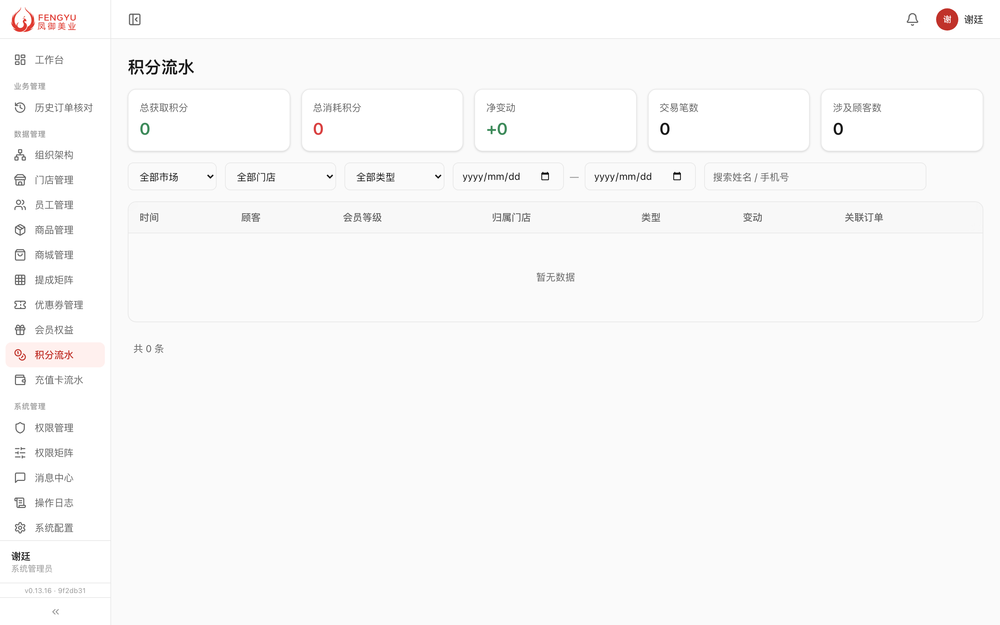

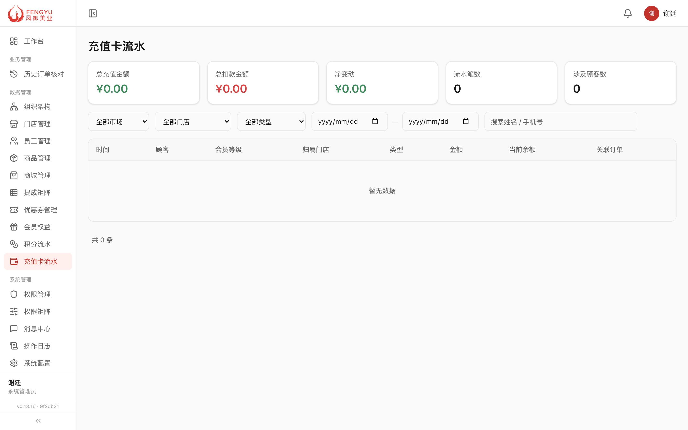

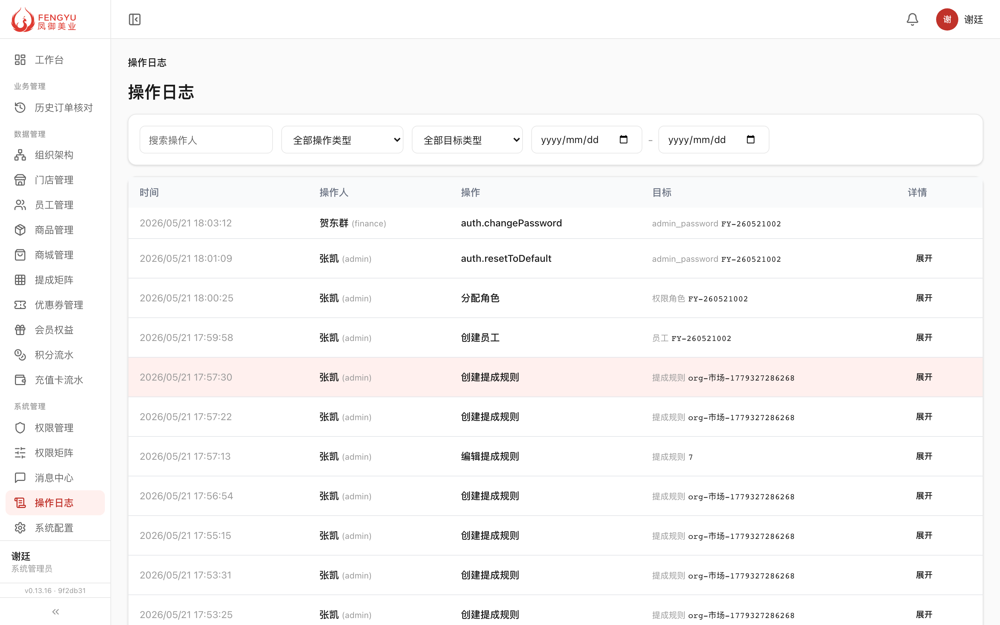

---

## B. 员工端小程序

> 以下为员工端小程序操作。截图请在微信中实际操作后补充。

### B1. 首次使用

1. 微信扫「员工端」小程序码打开。
2. 点「授权手机号登录」，微信弹窗授权 → 系统按手机号匹配到你的员工档案。
3. 若你同时有"门店"和"管理层"两种身份，会让你**选择进入哪个视图**。
4. 进入"门店"视图后，确认/选择**绑定的门店**（多门店的员工可在顶部切换门店）。

> 📷 截图占位：员工端登录授权页
> 📷 截图占位：选择视图 / 绑定门店页

### B2. 五个 Tab 速览

| Tab | 作用 |
|-----|------|
| 工作台 | 今日提成、月度业绩日历、各类待办 |
| 开单 | 帮顾客开单（仅店长） |
| 护理 | 服务单：待服务 / 服务中 / 已完成 |
| 顾客 | 顾客搜索、分类统计、分配、备注 |
| 我的 | 个人信息、门店绑定、库存查看 |

> 📷 截图占位：工作台
> 📷 截图占位：开单页 / 护理页 / 顾客页

### B3. 核心闭环：开单 → 收款 → 分配 → 服务

```
店长开单（选顾客、选商品、分配服务人员）
        │
        ▼
生成收款二维码 → 顾客扫码支付（微信/支付宝/储值卡）
        │         （线下现金：店长点"确认收款"）
        ▼
营业额分配（把营业额分到参与员工）
        │
        ▼
服务：开始服务 → 完成服务（自动扣次数 + 自动算服务提成）
```

> 📷 截图占位：开单 4 步结算 / 收款二维码 / 营业额分配 / 服务单完成

### B4. 其他常用操作

- **预约**：确认顾客预约、到店"入店"签到。
- **顾客分配**：店长把顾客分配给指定员工。
- **退款**：店长发起退款，经理审批。

---

## C. 顾客端小程序

> 以下为顾客端小程序操作，可发给顾客参考。截图请在微信中实际操作后补充。

### C1. 首次使用

1. 微信扫「顾客端」小程序码打开 → 自动生成顾客身份。
2. 在需要时点「授权手机号」绑定手机号。
3. 选择门店：定位附近门店或搜索 → 进入门店详情 → 首次绑定时选择**来源渠道**（如美团、抖音、老带新、地推等）、可填**推荐人**，完成绑定。

> 📷 截图占位：顾客端首页 / 选门店 / 绑定门店（来源渠道弹窗）

### C2. 浏览商品 → 下单 → 支付

1. 首页/商城按分类浏览或搜索商品，进入详情选规格、数量。
2. 加入购物车或直接结算。
3. 结算页可选：美容师、使用储值卡抵扣、使用优惠券。
4. 选支付方式：**微信支付 / 支付宝 / 线下 / 储值卡抵扣**，完成付款。

> 📷 截图占位：商城 / 商品详情 / 结算页 / 支付

### C3. 预约

进入预约 → 选已付费的项目 → 选日期 → 选时段 → 选美容师 → 提交（状态"待确认"，等门店确认）。

> 📷 截图占位：预约创建页

### C4. 其他功能

- **储值卡充值**：按档位或自定义金额充值。
- **积分**：查积分余额、等级、明细。
- **优惠券**：查未使用/已使用/已过期的券。
- **消息**：预约、订单、系统通知。
- **服务记录 / 订单**：查历史服务和订单。
- **个人资料**：改昵称、头像等。

> 📷 截图占位：储值卡 / 积分 / 优惠券 / 个人中心

---

# 第三部分：问题反馈（Bug 上报）规范

> 为了让问题能被快速定位和解决，请在反馈问题时**务必包含以下三要素**。信息越全，解决越快。

### 反馈三要素

1. **简要描述问题 + 你期望的结果**
   - 说清楚：发生了什么（实际现象）、你本来期望发生什么。
   - 例：「在开单页提交订单时提示'保存失败'，我期望能正常生成订单。」

2. **必须附截图**
   - 截下出问题的画面，**最好带上错误提示文字**。
   - 如果有报错弹窗、红色提示，请一并截进去。

3. **如果是"特定流程才能复现"的问题，写清复现步骤**
   - 一步步写：第几步、点了什么、填了什么，直到问题出现。
   - 例：「① 进入开单页 → ② 选顾客张三 → ③ 加入'10 次卡' → ④ 点提交 → 出现报错。」

### 反馈模板（复制即用）

```
【问题描述】
（一句话说清现象 + 你期望的结果）

【发生在哪个端 / 哪个页面】
（管理后台 / 员工端 / 顾客端；具体哪个菜单或页面）

【复现步骤】（如果是固定操作才出现，请填）
1.
2.
3.

【截图】
（在此粘贴截图，最好带错误提示）

【发生时间 / 操作账号】（可选，有助于排查）
```

### 好的反馈 vs 不好的反馈

| ❌ 不好的反馈 | ✅ 好的反馈 |
|----|----|
| "系统坏了" | "员工端开单页，选完商品点提交后一直转圈，约 10 秒后提示'网络错误'，期望能正常提交。附截图。" |
| "顾客付不了款" | "顾客端结算页选'微信支付'后点支付没反应（附截图）。复现：①加购10次卡 ②结算 ③选微信支付 ④点支付按钮无弹窗。" |
| "数据不对" | "后台营业额分配页，张三的提成显示 0，期望按提成矩阵应为 12%。附该订单截图。"（提示：多半是提成矩阵未覆盖该档位） |

---

# 附录

## 附录 A：角色权限速查表

| 角色 | 主要能做 | 能看的数据范围 |
|------|---------|--------------|
| 系统管理员 admin | 组织/门店/员工/商品/权限管理；发起并审批退款 | 全部 |
| 店长 manager | 开单、订单、营业额分配、服务单、预约、退款发起/审批 | 受管辖范围限制 |
| 财务 finance | 查订单、积分/充值卡流水（只读） | 受管辖范围限制 |
| 人事 hr | 组织架构、员工、权限 | 受管辖范围限制 |
| 商品管理员 product | 商品、分类、优惠券 | 全部商品 |
| 顾客管理员 customer_mgr | 顾客档案、疗程卡、优惠券发放 | 受管辖范围限制 |

> "管辖范围"由权限分配时选的"总部/市场/门店"决定：选总部看全部，选门店只看一家。

## 附录 B：数据录入依赖关系总表

```
组织架构（总部→市场→门店）
   ├── 门店管理（门店详情、坐标、图片）
   ├── 员工管理（先建职位/技能 → 再建员工）
   │        └── 权限管理（员工 + 角色 + 范围）
   ├── 品项分类（一级 → 二级）
   │        └── 商品管理（SKU，开单用）
   │                 └── 商城管理（商城分类 → 上架商品，顾客端用）
   ├── 提成矩阵（分配提成要用）
   ├── 优惠券（可选）
   ├── 会员权益（设规则，系统自动算等级）
   └── 系统配置（充值档位、首页轮播图、基础参数）
```

## 附录 C：坐标怎么获取

1. 浏览器打开 **https://lbs.qq.com/getPoint/**
2. 在左上角搜索框输入门店地址，回车。
3. 地图会定位到该地址并显示一个标记点；如果位置略有偏差，可直接在地图上点击精确位置。
4. 页面会显示该点坐标，格式为 `纬度,经度`（例如 `31.230416,121.473701`）。
5. 逗号**前面**是纬度，**后面**是经度，分别填入门店表单的"纬度""经度"框。

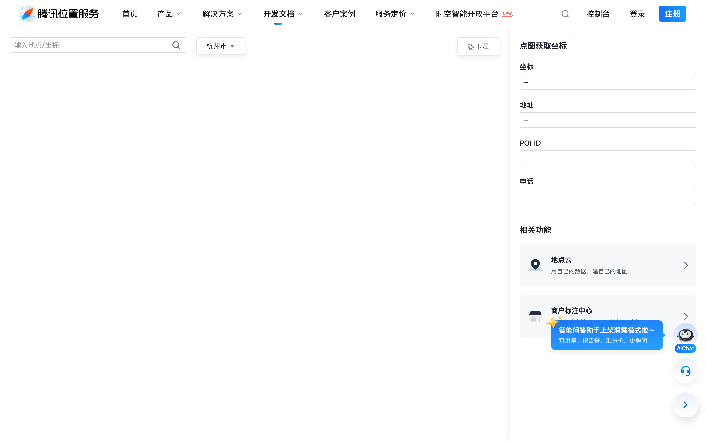

> 上图右侧"坐标"一栏即为所需的 `纬度,经度`；左上角搜索框输入地址后，地图上点选位置，坐标会自动显示在这里。

## 附录 D：常见问题（FAQ）

| 现象 | 多半原因 | 怎么解决 |
|------|---------|---------|
| 员工反映看不到订单/顾客 | 权限的"管辖范围"设小了，或没分配相应角色 | 到「权限管理」检查该员工的角色和范围 |
| 提成算出来是 0 | 「提成矩阵」没覆盖该订单类型/经营分类/金额档 | 到「提成矩阵」补对应规则 |
| 顾客端商城是空的 | 没配「商城管理」，只建了"商品管理"的 SKU | 完成第 7、8 步，把商品上架到商城 |
| 开单时选不到某商品 | 该商品"是否启用"为关，或不在可见范围 | 到「商品管理」开启、或调整可见范围 |
| 顾客端"附近门店"定位不到 | 门店没填经纬度坐标 | 到「门店管理」补坐标（附录 C） |
| 不知道怎么给顾客升会员 | 不用手动，系统每天自动按消费额算 | 只需在「会员权益」设好门槛规则 |

---

*本手册随系统迭代更新，如与实际界面不符以实际为准，并欢迎按第三部分规范反馈。*
