# 凤御美业·顾客端小程序 使用指南

> 适用对象：到店顾客。本指南教你如何用微信小程序完成**注册绑定门店、浏览下单、预约到店、充值、查看积分和优惠券**。
> 版本：v1.0 ｜ 最后更新：2026-05-21

---

## 目录

- [一、这是什么 / 怎么打开](#一这是什么--怎么打开)
- [二、第一次使用（注册与绑定）](#二第一次使用注册与绑定)
- [三、界面导览：底部四个入口](#三界面导览底部四个入口)
- [四、浏览商品与下单](#四浏览商品与下单)
- [五、预约到店](#五预约到店)
- [六、我的（个人中心）](#六我的个人中心)
- [七、常见问题](#七常见问题)

---

## 一、这是什么 / 怎么打开

凤御美业顾客端是一个**微信小程序**，用它你可以随时随地浏览门店服务、下单付款、预约到店、查看自己的疗程卡/储值卡/积分/优惠券。

**打开方式**：用微信「扫一扫」扫描下方**顾客端小程序码**即可进入，无需下载安装。

| 顾客端小程序码 | 顾客端首页 |
|---|---|
| 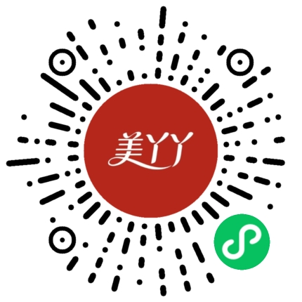 | 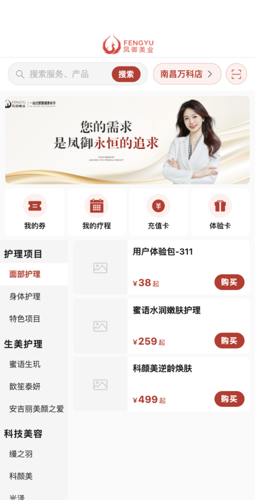 |

---

## 二、第一次使用（注册与绑定）

第一次打开小程序，按下面三步就能开始使用。

### 第 1 步：自动登录

打开小程序时会**自动用微信身份登录**，无需输入账号密码，直接进入首页。

### 第 2 步：选择并绑定门店

1. 在首页顶部搜索栏右侧，点「**选择门店**」。
2. 进入门店选择页：系统会按你所在城市显示附近门店；也可以在搜索框输入**门店名称或区域**查找。
3. 点中目标门店 → 进入**门店详情页**。
4. 点底部「**绑定此门店**」，弹出「请选择来源渠道」：
   - **线上来源**：美团 / 抖音 / 小程序
   - **线下来源**：推广部 / 全员地推 / 外请团队拓客 / 老带新 / 转让店 / 自进店 / 员工或家属
   - 如有推荐人，可在「推荐人（选填）」填写推荐人姓名。
5. 点「**确认绑定**」，提示"门店已绑定"即完成。

> 💡 绑定门店后，你浏览的商品、下单、预约都属于这家门店。

| 选择门店页 |
|---|
| 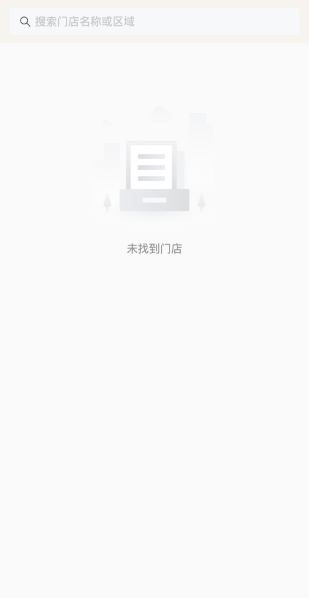 |

> 📷 截图占位：门店详情 + 来源渠道选择弹窗（需在门店详情点"绑定此门店"触发，待补）

### 第 3 步：绑定手机号（下单/预约时）

第一次**下单或预约**时，如果还没绑定手机号，会弹出「需要绑定手机号」：

- 点「**授权手机号**」→ 微信弹窗确认 → 自动完成绑定，继续刚才的操作。

> 📷 截图占位：授权手机号弹窗

---

## 三、界面导览：底部四个入口

小程序底部有 **4 个 Tab**：

| Tab | 作用 |
|-----|------|
| **首页** | 浏览服务/商品、分类、搜索、轮播 |
| **预约** | 查看和发起预约 |
| **凤御馆** | 品牌介绍专页 |
| **我的** | 个人中心：订单、疗程卡、充值卡、优惠券、积分、消息 |

> 📷 截图占位：底部四个 Tab（首页/预约/凤御馆/我的）—— 自动截图无法包含微信原生底部栏，需在微信里手动截一张首页（含底部 Tab）补入

| 凤御馆品牌页 |
|---|
|  |

---

## 四、浏览商品与下单

### 4.1 浏览与选择

1. 在**首页**或商城按分类浏览，或用搜索框搜索想要的项目。
2. 点商品进入**详情页**，选择规格（次数/价格）。
   - 若是**组合套餐**，按提示勾选套餐内的项目（可能是"全选"或"N 选 M"），右侧实时显示套餐价。
3. 点「**立即下单**」直接结算；或「加入购物车」，之后在购物车里一起结算。

### 4.2 结算页

进入结算页后，从上到下依次确认：

- **商品明细**：规格、数量、单价。
- **指定美容师**（可选）：点击选择，默认"不指定"。
- **优惠券**：点「去选择」挑一张可用券（可不用）。
- **储值卡抵扣**：有余额时可打开开关用储值卡抵扣。
- **支付方式**（实付大于 0 时显示，三选一）：
  - **微信支付**
  - **支付宝**（生成二维码，用支付宝 App 扫码付）
  - **线下付款**（到店现场付，订单先保持"待支付"，店员确认后变"已支付"）
  - 若储值卡/优惠券已**全额抵扣**，则不显示支付方式，直接「确认支付」。
- 勾选「**我已阅读并同意《服务消费协议》**」。

最后点底部按钮（**微信支付 / 支付宝付款 / 提交订单 / 确认支付**，按所选方式显示）完成下单。

> 📷 截图占位：结算页（抵扣 + 支付方式 + 协议）—— 需购物车有商品才能进入，待补

| 商城（按分类） | 商品详情（选规格） |
|---|---|
| 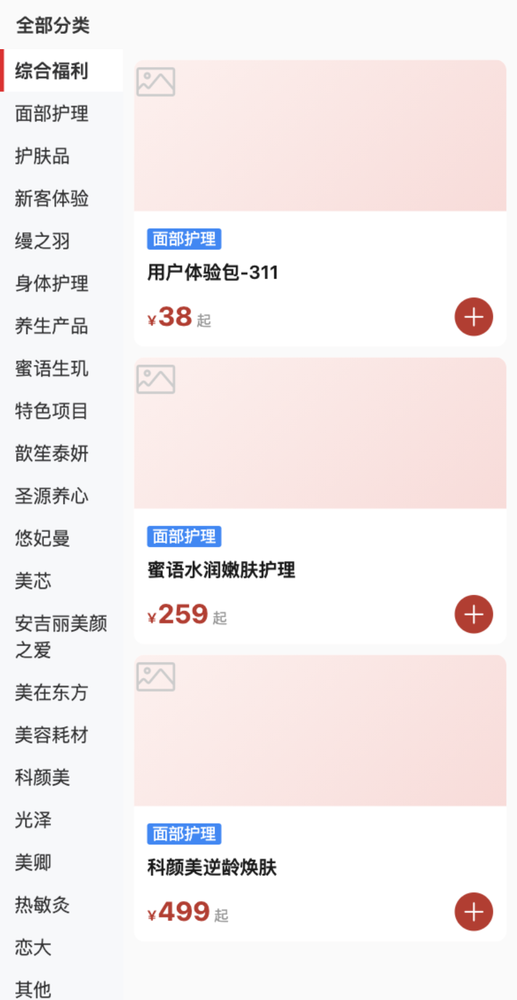 | 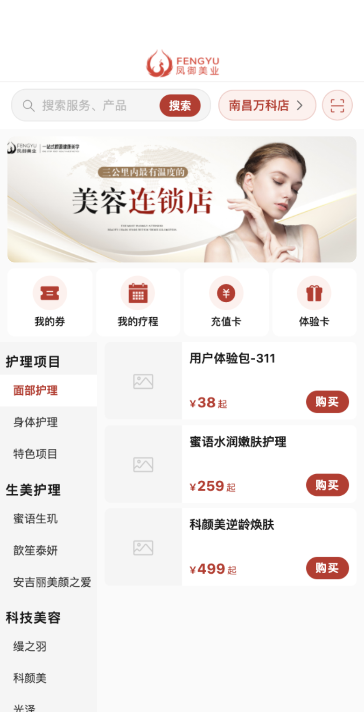 |

---

## 五、预约到店

点底部「**预约**」→ 右下角发起预约，按 6 步操作：

1. **关联疗程卡（可选）**：选一张已付未用的疗程卡，或选「不关联疗程卡」（仅预约到店时间）。
2. **选择日期**：日历选择，范围为今天起 90 天内。
3. **选择到店时段**（5 个时段，选一个）：
   - 上午 09:00-11:00
   - 上午 11:00-13:00
   - 下午 13:00-15:00
   - 下午 15:00-17:00
   - 下午 17:00-19:00
   （当天已过的时段不可选）
4. **指定美容师（可选）**：从本店美容师里选，默认"不指定"。
5. **备注（选填）**：填写特殊需求。
6. 点「**提交预约申请**」→ 回到预约列表，新预约显示"**待确认**"，等门店确认。

> 💡 在「预约」Tab 可按状态（待确认/已确认/已取消）查看，也可取消预约。

| 发起预约页 | 预约列表（按状态） |
|---|---|
| 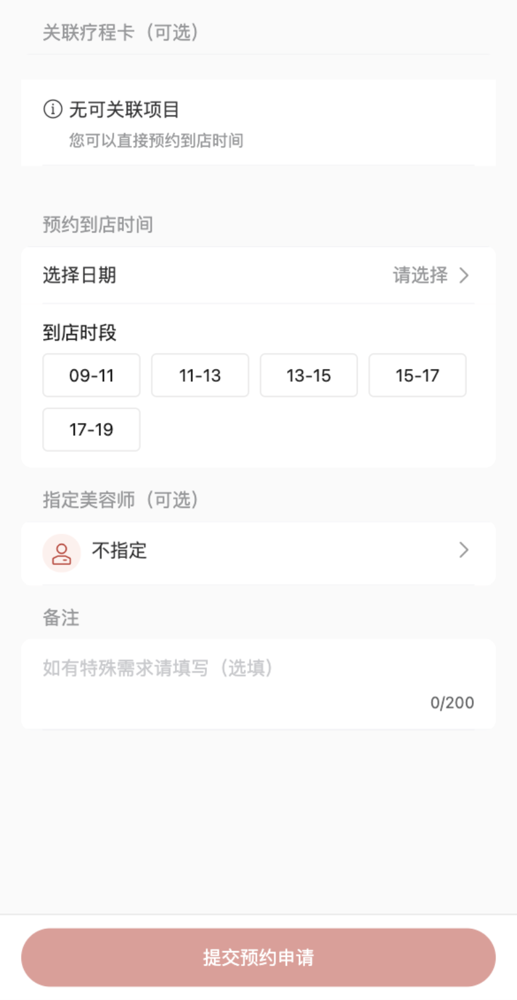 | 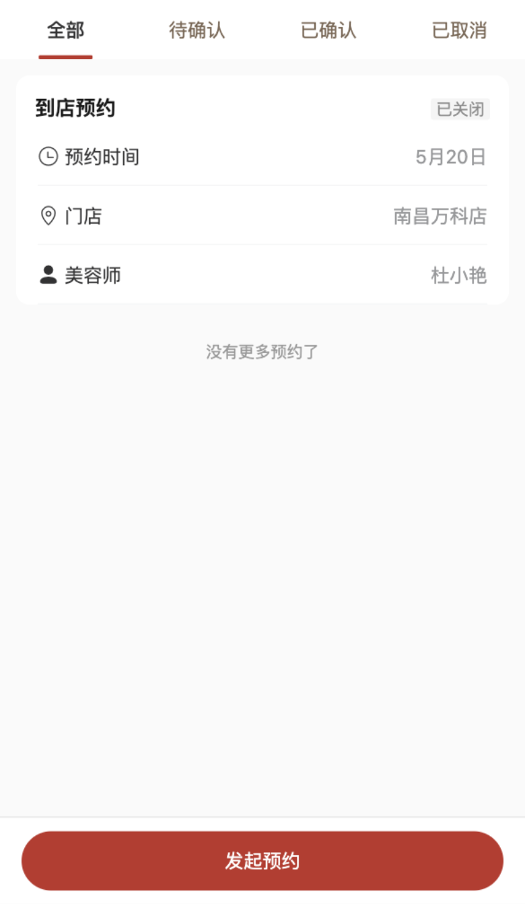 |

---

## 六、我的（个人中心）

点底部「**我的**」进入个人中心。

**顶部卡片**：头像、昵称、手机号、会员等级、当前绑定门店（点头像可编辑资料）。

**四个快捷宫格**：优惠券 / 积分 / 消息 / 充值卡。

**「我的服务」列表**：我的订单 / 我的疗程卡 / 我的预约 / 我的优惠券 / 服务记录。

### 6.1 我的订单

查看所有订单（按 待支付/已支付/已关闭 筛选）。待支付订单可「继续支付」；已支付订单可发起预约。

### 6.2 我的疗程卡

查看已购疗程卡的总次数 / 已用 / 剩余，可直接发起预约消费。

| 我的（个人中心） | 我的订单 | 我的疗程卡 |
|---|---|---|
| 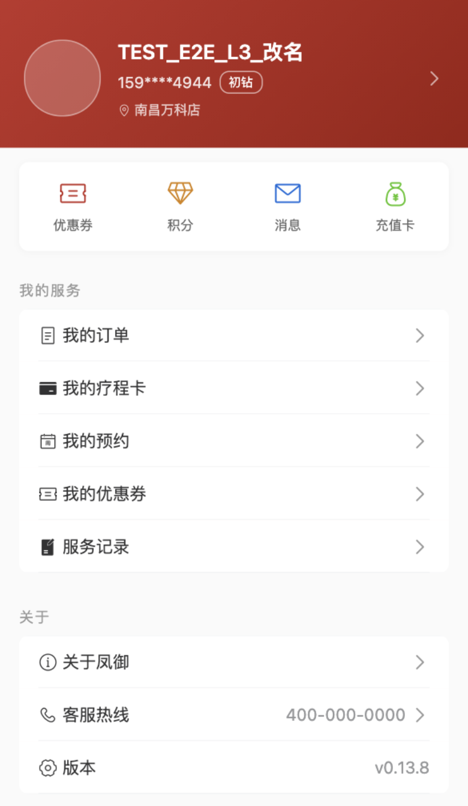 | 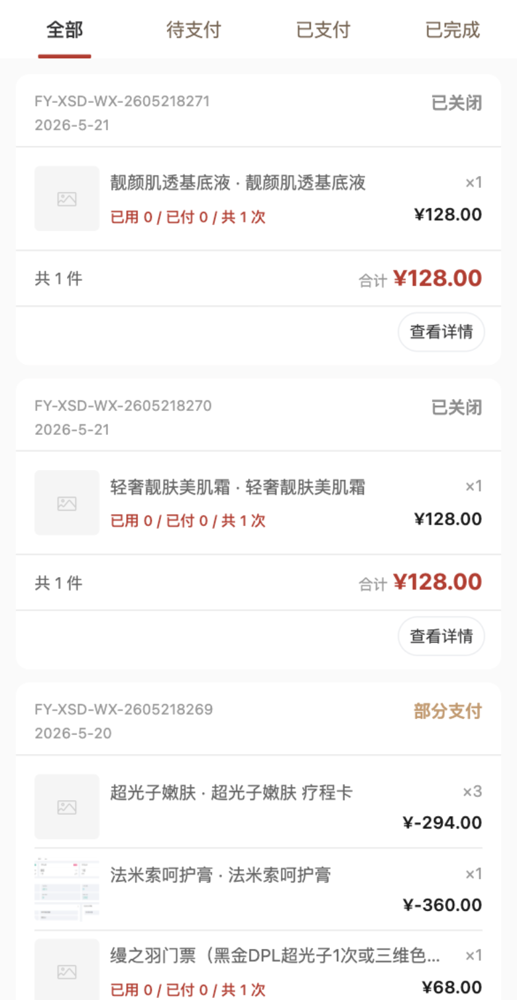 | 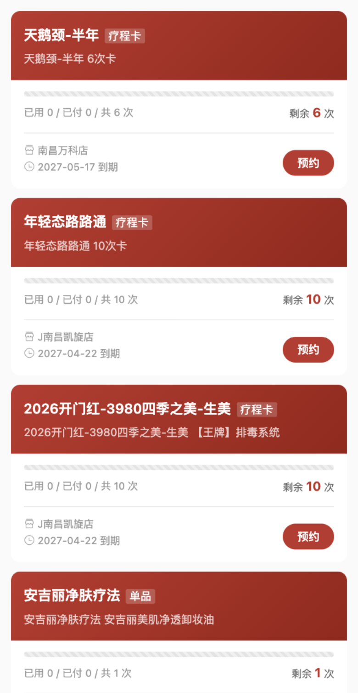 |

### 6.3 充值卡（储值卡 + 充值）

- **储值卡**：查看总余额、各卡余额和交易记录（充值/消费/退款）。储值卡**跨门店通用**。
- **充值**：进入充值页，按预设档位（如"充 1000 到账 1000""充 500 实付 450"）或自定义金额充值，按结算流程付款，到账后余额即时可用。

### 6.4 我的优惠券

按 未使用/已使用/已过期 查看优惠券，点开看适用规则。

| 储值卡列表 | 充值档位页 | 我的优惠券 |
|---|---|---|
| 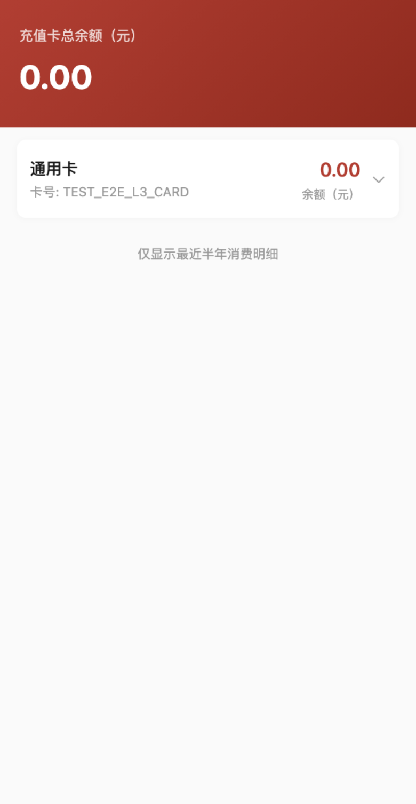 | 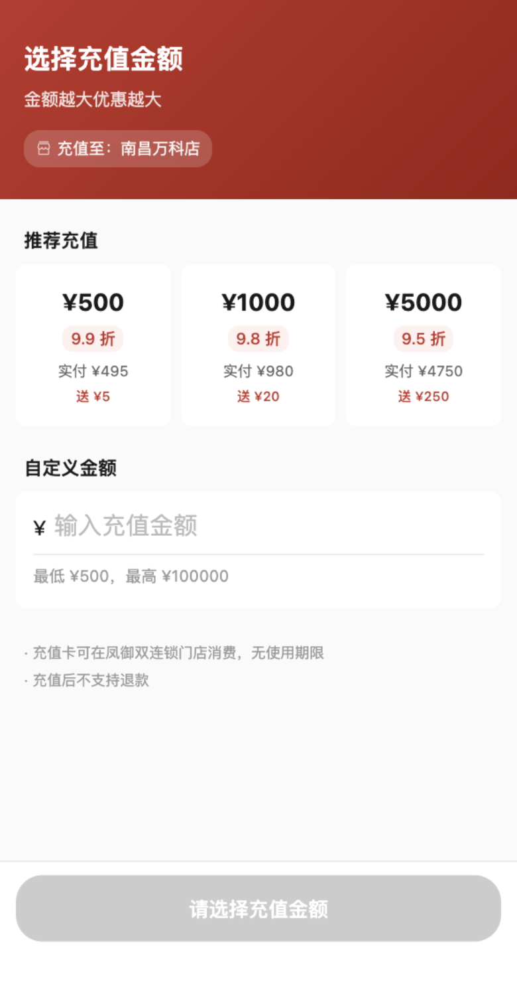 | 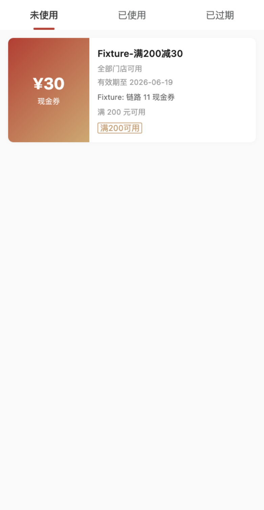 |

### 6.5 积分

查看积分余额、会员等级、下一等级门槛，以及积分明细。

> 💡 会员等级由系统按你近 12 个月的消费自动评定，无需手动操作。

### 6.6 服务记录

查看已完成的服务历史（日期、门店、美容师、项目、次数）。

### 6.7 消息

接收预约通知、订单通知、系统消息，红点表示未读。

| 积分中心 | 服务记录 | 消息中心 |
|---|---|---|
| 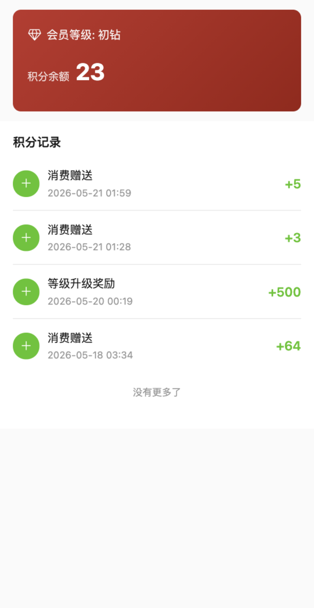 | 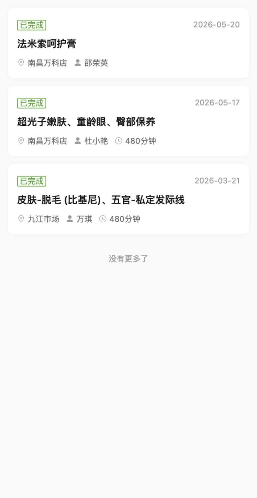 | 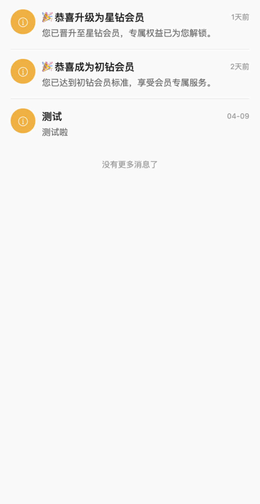 |

### 6.8 编辑资料

点头像进入资料编辑，可改昵称、头像等。

| 资料编辑 |
|---|
| 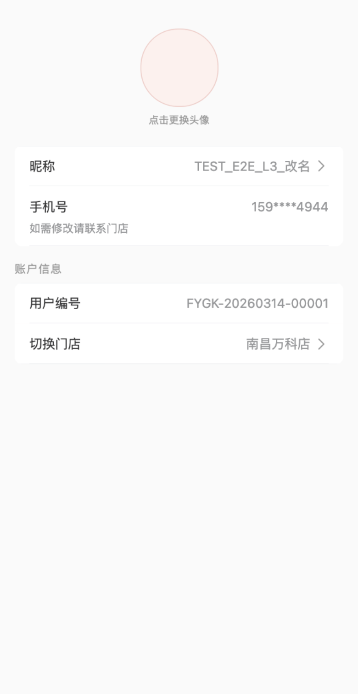 |

---

## 七、常见问题

| 现象 | 多半原因 | 怎么解决 |
|------|---------|---------|
| 进来看不到商品 | 还没绑定门店 | 首页顶部「选择门店」绑定一家门店 |
| 下单/预约提示要绑手机号 | 首次操作需绑定 | 点「授权手机号」一键绑定 |
| 储值卡余额在别的门店能用吗 | 储值卡跨门店通用 | 任意已绑定门店均可抵扣 |
| 预约一直是"待确认" | 等门店确认 | 门店确认后状态变"已确认" |
| 想换绑别的门店 | 需向门店申请解绑 | 在门店详情发起解绑申请，店长审批后再绑新店 |
| 会员等级怎么升 | 系统按消费自动评定 | 正常消费即可，无需手动 |

---

*本指南随小程序迭代更新，如与实际界面不符以实际为准。*
